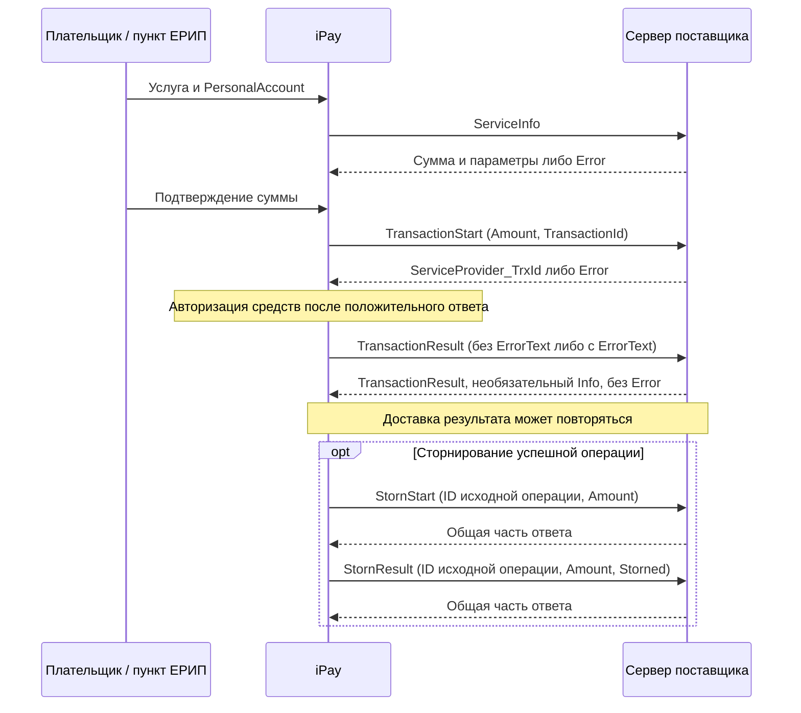

# iPay: структура обмена с поставщиком услуг

Дата разбора: 7 октября 2026 года. Статус: описание предоставленного первоисточника; применимость этой редакции к договору Judo Pride ещё не подтверждена. Задача: [#72](https://github.com/StarMadeGalaxy/JudeOS/issues/72), продолжение сбора входных данных: [#17](https://github.com/StarMadeGalaxy/JudeOS/issues/17), реализация адаптера: [#41](https://github.com/StarMadeGalaxy/JudeOS/issues/41).

## Источник и границы достоверности

Пользователь предоставил файл `3403_03_iPay_агрегатор_Обмен_с_поставщиком_услуг.pdf`. [Неизменённый PDF](sources/ipay-service-provider.pdf) содержит 20 страниц, © ЗАО «БиСмарт». На обложке указан **УАРС.3403.03**, в колонтитулах — **УАРС.3403.04**. Метаданные создания/изменения PDF: 17 июля 2017 года; это не дата подтверждения актуальности протокола.

SHA-256 оригинала: `1f0e8a8967f063a2ac7433cde196dc2e4dbf7ce03204fc05432378186876be3e`.

Ниже ссылки вида «§1.3, с. 6» относятся к разделам и страницам этого PDF. Протокол описывает on-line обмен iPay с биллинговой системой поставщика, который выставляет сумму (§введение, с. 3). Документ не описывает выгрузку реестра, запрос истории операций или банковское зачисление. Это не подтверждение подключения данного API у клуба. Предложения для JudeOS вынесены в [ADR 0003 со статусом «предложено»](../../../planning/adr/0003-ipay-inbound-payment-protocol.md).

## Транспорт, кодировка и типы

Источник: §1.1, с. 4; §1.3, с. 6.

- **Инициатор всех пяти запросов — iPay**, получатель — сервер поставщика услуг. Это входящий интерфейс поставщика, а не REST-клиент JudeOS к iPay.
- HTTP или HTTPS, метод POST. XML передаётся **в параметре `XML`**; результат обработки — XML в теле HTTP-ответа. Content-Type, способ кодирования параметра и путь endpoint не заданы: raw XML, form-urlencoded или multipart нельзя выбрать по этому PDF.
- HTTP **200** означает успешную доставку сообщения; успех оплаты определяется содержимым протокола, а не этим кодом.
- Сообщения формируются в **windows-1251**. Дата/время в общей части: `YYYYMMDDhhmmss`, без часового пояса. Дробный разделитель — **запятая**, например `110,00`; примеры допускают целую сумму без дробной части.
- `M` — обязательный элемент/атрибут и значение; `ME` — обязательный элемент с необязательным значением; `O` — необязательный; `*` — повторяемый. `Sn` — строка до n символов; `Nn` — целое до n цифр; `Xn` — до n шестнадцатеричных цифр; `Fn,m` — до n цифр целой и m дробной части; `D` — дата/время; `B` — строго `Y`/`N`. `CDATA` — секция XML. Справочник типов не задаёт дополнительных полей сообщений.
- Заголовок подписи: `ServiceProvider-Signature: <алгоритм>: <значение>` в запросе и/или ответе. Алгоритм, ключ, подписываемые байты, каноникализация, кодирование значения и обязательность подписи в каждом направлении **не определены**. HMAC/SHA/другой алгоритм из этого документа не следует.
- VPN рекомендован при наличии технических возможностей; документ не требует его безусловно. Конкретный защищённый контур согласовывается до подключения.

## Общая часть запроса и ответа

Источник: §1.3, таблицы 1.2–1.3, с. 6. Пути ниже относительны к корню запроса `ServiceProvider_Request`; namespace/XSD не предоставлены.

| Поле | Обязательность и тип | Смысл |
|---|---|---|
| `RequestType` | M, S20 | Один из пяти типов из следующего раздела |
| `DateTime` | M, D | `YYYYMMDDhhmmss`, дата/время сообщения |
| `ServiceNo` | O, N9 | Номер услуги у поставщика |
| `PersonalAccount` | M, S30 | Уникальный идентификатор плательщика **в пределах услуги**: лицевой счёт, заказ, телефон и т. п. |
| `Currency` | M, N3 | Код валюты; для BYN — **933** |
| `RequestId` | M, N8 | Номер запроса в iPay; **одинаков для цепочки `ServiceInfo` → `TransactionStart` → `TransactionResult`** |
| `Language` | O, S3 | `RU` или `EN`; по умолчанию `RU` |

`Version=1` присутствует в примерах (§1.9, с. 14–18), но отсутствует в таблице общей части. Его обязательность и допустимые версии неизвестны; не превращать пример в подтверждённое правило.

Корень ответа — `ServiceProvider_Response`. При ошибке обработки допускается `Error`; внутри обязательны одна или несколько строк `ErrorLine` (M*, S999), максимальный отображаемый текст ошибки — 999 символов. Если есть `Error`, элемент ответа конкретного типа не заполняется. **Исключение: ответ на `TransactionResult` не может содержать `Error`** (§1.6, с. 11). `Error` ответа и `ErrorText` результата оплаты имеют разные назначения.

## Пять сообщений

### ServiceInfo — проверка суммы и параметров

Источник: §1.4, таблицы 1.4–1.5, с. 7–8; пример с. 14.

В запросе `RequestType=ServiceInfo`. Поле `ServiceInfo/Agent` — M, N3, код расчётного агента; для банков — последние три цифры МФО. Контейнер `ServiceInfo` есть в примере и подразумевается путём поля, но отдельная строка его обязательности в таблице 1.4 пропущена.

В ответе обязателен `ServiceInfo`; его поля:

| Путь внутри `ServiceInfo` | Обязательность и тип | Смысл/значение по умолчанию |
|---|---|---|
| `Amount` | M | Контейнер суммы |
| `Amount/@Editable` | O, B | Разрешить изменение суммы; по умолчанию нет |
| `Amount/@MinAmount` | O, F12,2 | Минимально допустимая вводимая сумма |
| `Amount/@MaxAmount` | O, F12,2 | Максимально допустимая вводимая сумма |
| `Amount/@AmountPrecision` | O, F12,2 | Точность/кратность вводимой суммы |
| `Amount/Debt` | M, F12,2 | Сумма, называемая задолженностью в протоколе |
| `Amount/Penalty` | O, F12,2 | Пени |
| `Name` | O | ФИО плательщика |
| `Name/@Editable` | O, B | Разрешить изменение ФИО; по умолчанию нет |
| `Name/Surname`, `Name/FirstName`, `Name/Patronymic` | O, S30 каждое | Фамилия, имя, отчество |
| `Address` | O | Адрес плательщика |
| `Address/@Editable` | O, B | Разрешить изменение адреса; по умолчанию нет |
| `Address/City`, `Address/Street` | O, S30 каждое | Населённый пункт, улица |
| `Address/House`, `Address/Building`, `Address/Apartment` | O, S10 каждое | Дом, корпус, квартира |
| `Info` | O | Информация плательщику |
| `Info/InfoLine` | M*, S999 | При наличии `Info` — строки; отображаемый текст суммарно до 2000 символов |

`Editable` позволяет менять сумму технически; произвольная добровольная поддержка и значения min/max/precision для клуба этим не согласованы. Имя плательщика не является надёжной связью с ребёнком или месяцем. `Debt` — имя внешнего поля, оно не превращает рекомендацию JudeOS в юридическую задолженность; этот разрыв требует согласования с владельцем/iPay.

### TransactionStart — начало оплаты

Источник: §1.5, таблицы 1.6–1.7, с. 9–10; пример с. 15.

`RequestType=TransactionStart`, контейнер `TransactionStart` обязателен. Поля внутри:

| Поле | Обязательность и тип | Смысл |
|---|---|---|
| `Amount` | M, F12,2 | Сумма операции |
| `TransactionId` | M, N12 | Уникальный номер транзакции в системе iPay |
| `Agent` | M, N3 | Расчётный агент |
| `AuthorizationType` | M, S10 | Способ идентификации плательщика для авторизации суммы; перечисление не задано |
| `AuthorizationType/@Ident` | O, S30 | Значение идентификации |
| `Name` | O | ФИО, если разрешалось редактирование; дочерние поля как в ServiceInfo, O/S30 |
| `Address` | O | Адрес, если разрешалось редактирование; дочерние поля как в ServiceInfo, O/S30 или O/S10 |

В успешном ответе обязателен `TransactionStart/ServiceProvider_TrxId` (M, S12) — **номер транзакции поставщика**, который поставщик возвращает iPay. Внутри `TransactionStart` необязателен `Info` с `InfoLine` (M*, S999), суммарно до 2000 отображаемых символов на чеке. Внутренний UUID нельзя без преобразования вернуть в S12.

Положительный ответ разрешает продолжить авторизацию средств; **это ещё не завершённая оплата**. Схема на с. 20 упоминает проверку параметров/суммы и возможную блокировку заказа от параллельной оплаты. Как переносить это на добровольную поддержку, решается отдельно.

### TransactionResult — результат оплаты

Источник: §1.6, таблицы 1.8–1.9, с. 11; примеры с. 16–17.

`RequestType=TransactionResult`, контейнер `TransactionResult` обязателен:

| Поле | Обязательность и тип | Смысл |
|---|---|---|
| `TransactionId` | M, N12 | Номер iPay из начала операции |
| `ServiceProvider_TrxId` | M, S12 | Номер поставщика из ответа TransactionStart |
| `ErrorText` | O, S255 | Присутствует только при неуспешном завершении оплаты |

Успех передаётся отсутствием `ErrorText`, отдельного `Success`/`Status` нет. При отсутствии `ErrorText` нельзя заменять неизвестную/несогласованную операцию автоматически созданным поступлением: в результате нет `Amount`, сумма и связи берутся из ранее сохранённого начала операции. Поведение при пустом `ErrorText` PDF не определяет.

В ответе обязателен контейнер `TransactionResult`; необязателен `Info/InfoLine` (M*, S999, суммарно до 2000 символов). Эти строки выводятся на чек, а при SMS-оплате — в ответное SMS. **Ответ запрещает `Error`, даже если внутри системы поставщика обнаружена проблема.** В примере на с. 17 предупреждение передано в `InfoLine`; это сообщение человеку, а не машинный отказ. Стратегию долговременного приёма/разбора и HTTP-ответов при недоступной БД нужно согласовать при реализации.

### StornStart — начало сторнирования

Источник: §1.7, таблица 1.10, с. 12; пример с. 17.

Сторнировать можно только успешно выполненную операцию. `RequestType=StornStart`, контейнер `StornStart` обязателен; поля `TransactionId` (M, N12), `ServiceProvider_TrxId` (M, S12), `Amount` (M, F12,2) относятся к исходной операции. Ответ — только общая часть, например `<ServiceProvider_Response/>`; успешный ответ разрешает процесс, но не подтверждает завершение сторно.

### StornResult — результат сторнирования

Источник: §1.8, таблица 1.11, с. 13; пример с. 18.

`RequestType=StornResult`, контейнер `StornResult` обязателен; `TransactionId` (M, N12), `ServiceProvider_TrxId` (M, S12), `Amount` (M, F12,2), `Storned` (M, B). `Storned=Y` означает выполненное сторнирование, `N` — не выполненное. Ответ — только общая часть. Особый запрет `Error` документ устанавливает только для `TransactionResult`.

Отдельный ID сторно, инициирование возврата поставщиком, частичное сторно, несколько сторно одной операции и их сроки не описаны. Поддержка внутреннего частичного возврата в MVP не доказывает возможность выполнить его через этот протокол.

## Последовательность и идентификаторы

Источник: §1.10, с. 19–20. Схема передаёт успешную цепочку и ветки результата, без добавления неописанных методов iPay.

Таймаут доставки `TransactionStart` на схеме с. 20 ведёт к формированию отмены платежа. Отказ клиента/таймаут подтверждения также имеет ветку результата. При ошибке обработки поставщиком или транспорта **результат повторно отправляется «в течение ХХ часов»**: численное значение, интервалы и лимиты не заданы. Гарантии повторов остальных типов и порядка при повторной доставке не установлены.

Не смешивать три идентификатора: `RequestId` коррелирует сообщения одной цепочки и повторяется между типами; `TransactionId` идентифицирует транзакцию iPay; `ServiceProvider_TrxId` создаётся поставщиком. `PersonalAccount` идентифицирует плательщика/заказ внутри услуги, а не отдельное поступление. Уникальность транзакции в системе заявлена PDF, но границы договора, разделение сред и соответствие ID в реестре всё ещё проверяются в #17. `Agent` — расчётный агент, не ID клуба/tenant.

## Ссылка на оплату

Источник: §1.10, с. 19. Шаблон из документа: `https://адрес/!iSOU.Login?srv_no=...&pers_acc=...&amount=...&amount_editable=...&provider_url=...`. Реальный адрес предоставляется после регистрации услуги; домен здесь не установлен.

| Параметр | Обязательность | Назначение |
|---|---|---|
| `srv_no` | Не помечен необязательным | Номер зарегистрированной услуги в системе |
| `pers_acc` | Не помечен необязательным | Уникальный номер оплаты |
| `amount` | Необязателен | Сумма; может отображаться в SMS при соответствующей опции |
| `amount_editable` | Необязателен | `N` запрещает изменение суммы; описано особое поведение отображения суммы в SMS |
| `provider_url` | Необязателен | Ссылка возврата клиента после оплаты |

Документ не задаёт тождество `srv_no` и XML-поля `ServiceNo`, формат decimal в URL, URL encoding и правила допустимых redirect. Возврат браузера не является подтверждением платежа. Ссылка и личные кабинеты не добавляются автоматически в MVP этим разбором.

## Противоречия и неполнота первоисточника

Источник: сравнение §1.3–1.9, с. 6–18, с визуальной схемой с. 20.

1. Обложка `.03`, колонтитулы `.04`; нет однозначной редакции/актуального versioning. `Version=1` только в примерах.
2. На с. 14 пример содержит невалидный тег `< ServiceInfo>`. Пустой `<Penalty/>` там не согласуется с обязательным значением для присутствующего числового поля O/F12,2. Примеры нельзя копировать как валидные fixtures без решения этих вопросов.
3. Таблица 1.4 не перечисляет контейнер `ServiceInfo` отдельно. В ссылках ряда таблиц написано `ServiceProviderTrxId`, хотя сами поля и примеры используют **`ServiceProvider_TrxId`**.
4. Источник суммы в таблицах сторно ссылается на `ServiceProvider_Response/TransactionStart/Amount` и `.../StornStart/Amount`, хотя такие поля ответа не описаны. `Amount` сторно обязателен, но точную семантику и допустимое частичное значение нужно подтвердить.
5. Не заданы Content-Type, URL входа, алгоритм подписи, зона DateTime, отрицательные суммы/границы нуля, таймауты, численный срок повторов и строгая обработка необязательного пустого значения. XSD и коды машинных ошибок отсутствуют.

## Что получить перед адаптером Judo Pride

Владелец/менеджер и iPay предоставляют сведения для #17; общий финансовый контракт согласуется до зависимой реализации #41:

- Подтверждённую актуальную редакцию, договор и активацию on-line обмена для клуба; номера услуг/залов, provider account, test/production, endpoint и способ POST-параметра `XML`.
- Подпись в обоих направлениях: алгоритм, ключи вне Git, байты/каноникализация, encoding, ротация, тестовые векторы; HTTPS, IP/VPN и лимиты запросов.
- Семантику лицевого счёта для нынешнего кода зала и ручного имени; возможность индивидуального номера, связь с ребёнком/семьёй/периодом. Поля периода поддержки в PDF нет.
- Согласованное представление добровольной рекомендации через `Debt`; редактирование суммы, минимумы/максимумы/кратность, нулевая сумма. Пени клубом не подтверждены.
- Область уникальности ID между услугами/договорами/средами и соответствие ID в реестрах; часы/зону DateTime, versioning и обработку противоречий примеров.
- Таймауты/повторы/порядок и поздние результаты; сверку неизвестного результата, конфликтующего ID и операции после restore, HTTP-стратегию при сбое хранения.
- Полное/частичное сторно, повторные сторно и подтверждение возвратов; обезличенный реестр с контрольными итогами, комиссии, время банковского зачисления и допустимую задержку.

При реализации нужны синтетические проверки windows-1251/кириллицы, запятой/точных копеек, длины ID, всех пяти типов, дубликатов/конкуренции, ошибки/таймаута после TransactionStart, отсутствующего начала, конфликтующего результата, запрета Error в TransactionResult, Storned=Y/N и восстановления. Сейчас адаптер, исполняемый контракт, fixtures и SQL-миграции не создаются: задача сохраняет сведения, а не выбирает неподтверждённый профиль подключения.

## Документирование endpoint’а адаптера

При реализации входящий endpoint регистрируется на chi v5 и включается в общий OpenAPI/реестр согласно [правилам API](../../API-DOCUMENTATION.md). Описать транспорт POST/XML, согласованные Content-Type/кодировку/подпись, лимиты, XML-схемы/примеры всех пяти сообщений и HTTP/протокольные ответы. Неподтверждённый профиль подключения не выдумывать. Подробный протокол остаётся в этом документе; ссылки на него входят в описание операции. Swagger UI показывает контракт HTTP, но не заменяет проверку XML/подписи и реального обмена.
