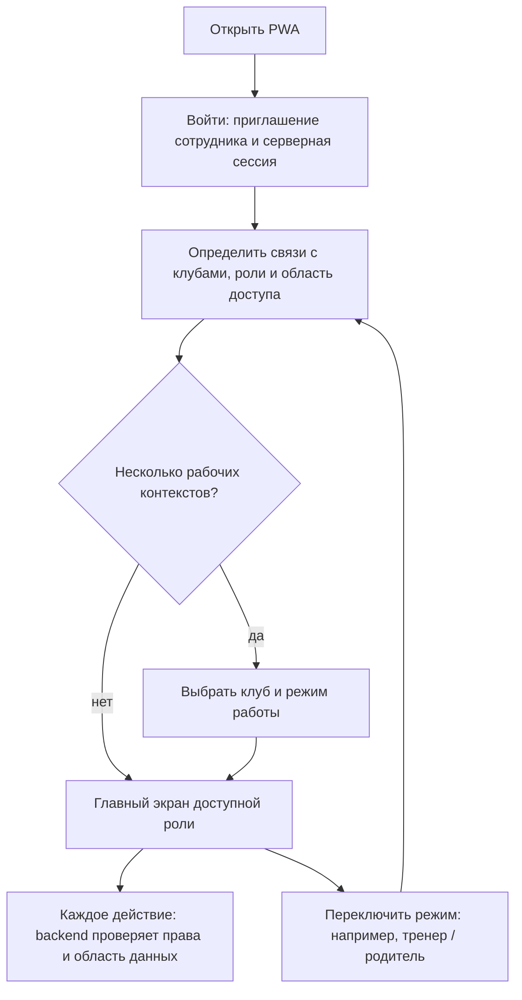
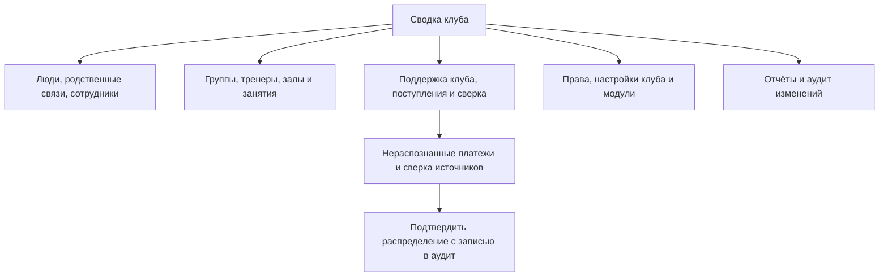
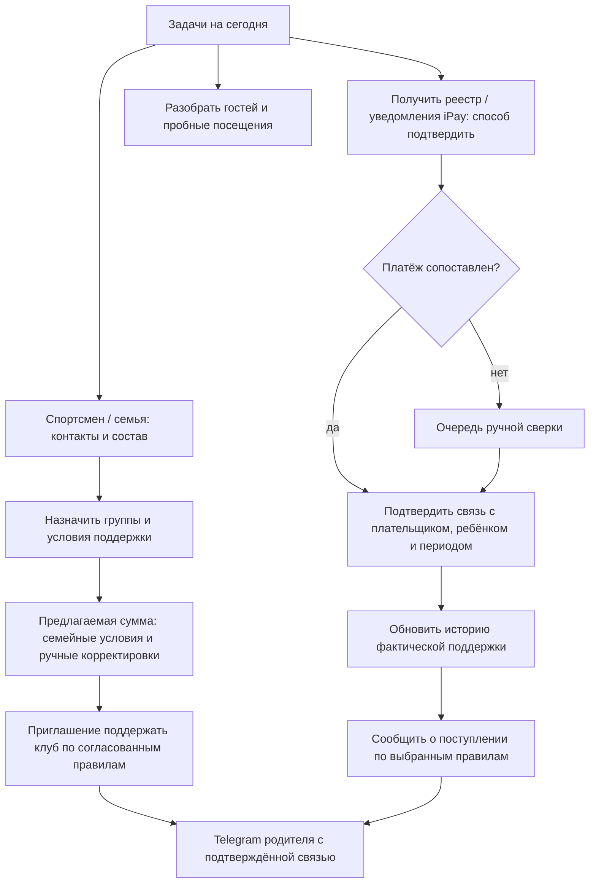
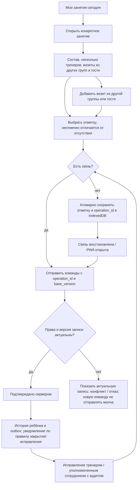
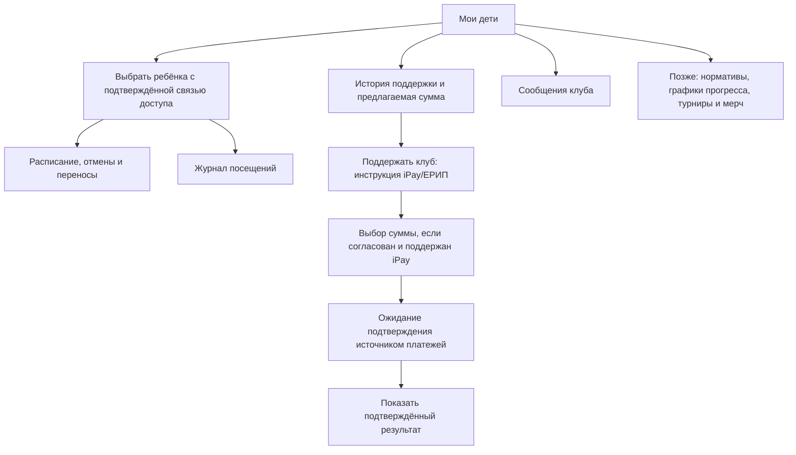
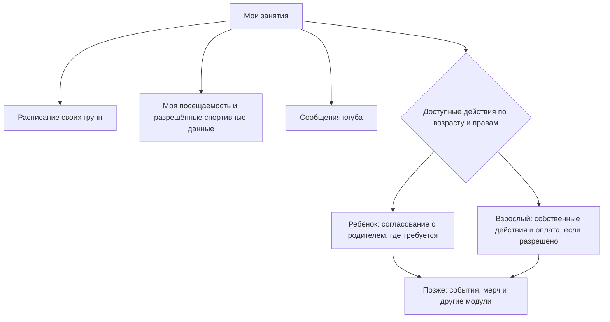
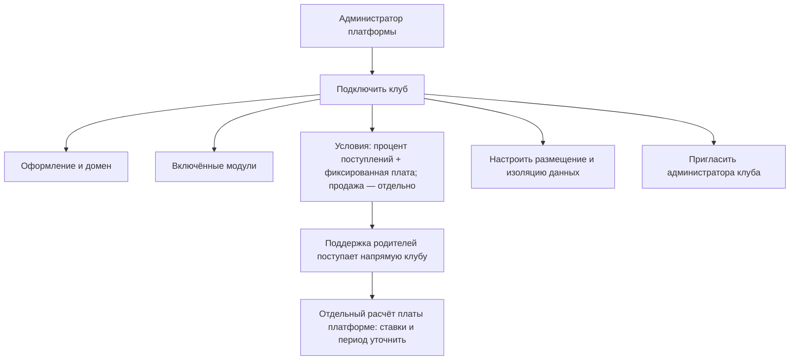
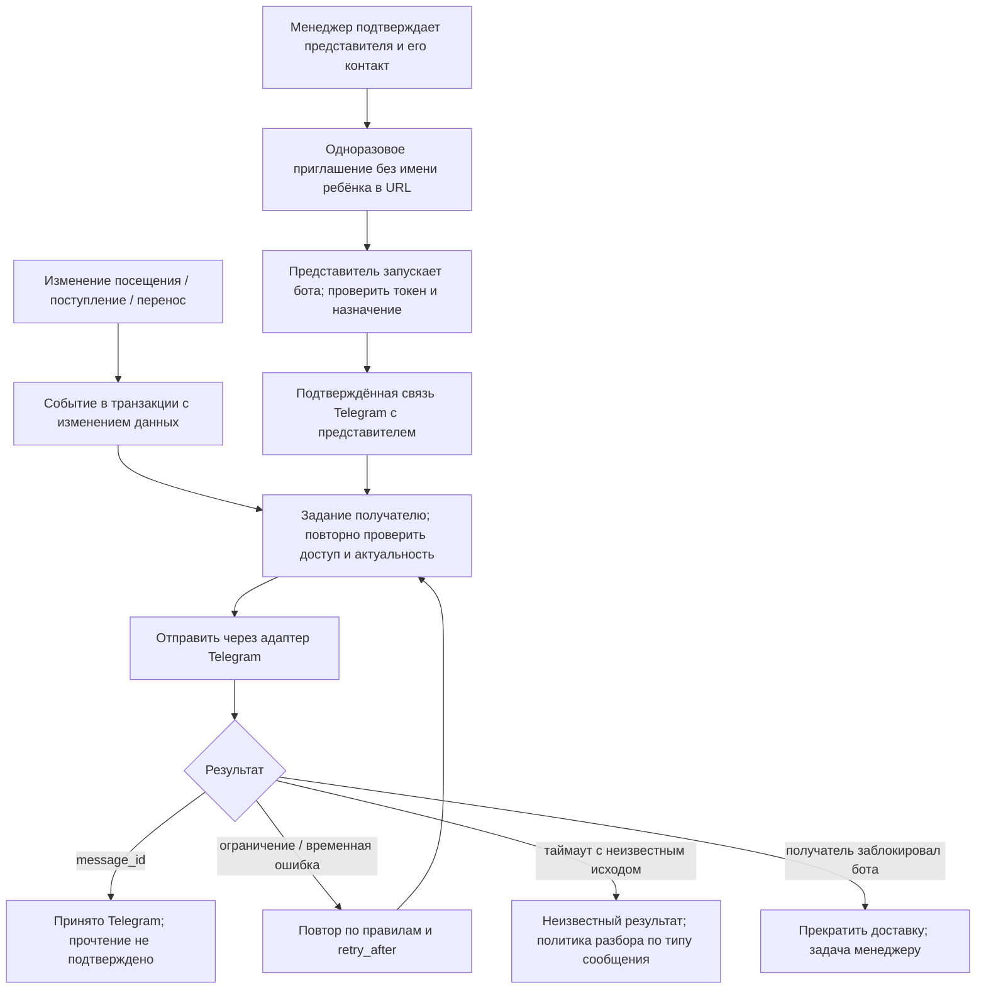
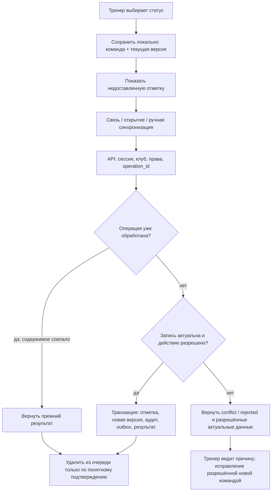

# Flow приложения Judo Pride

Версия 0.3 от 7 октября 2026 года. Сценарии обновлены по разговору с владельцем и остаются проектными предложениями. Первая версия — сотрудники. Родители и спортсмены показаны как будущий этап; подробные права и доступность модулей ещё согласуются.

## Вход и совмещение ролей

Переключатель не создаёт права. Одно лицо может иметь несколько назначений. Локальные данные разделяются по аккаунту и клубу; правила очистки при переключении уточняются.

## Администратор клуба

## Менеджер / сотрудник учёта

Функции сверки могут принадлежать отдельной роли бухгалтера, если она нужна клубу. Объём полномочий менеджера не фиксируется ограничениями меню из исходного файла. Рекомендация поддержки и фактическое поступление различаются; отсутствующая добровольная поддержка не создаёт задолженность. Неоднозначный платёж по имени проходит ручную сверку.

## Тренер

Посещение ребёнка не должно превращаться в «отсутствовал» только из-за недоставленной отметки; «не отмечен» предлагается отдельным состоянием учёта. Статусы завершения занятия, область доступа и допустимые сроки исправления ещё не выбраны. Разовый визит не меняет автоматически основную группу. Отмена ошибочной отметки и разрешение конфликта сохраняют историю.

## Родитель — будущий кабинет

## Спортсмен — будущий кабинет

Возраст включения кабинета, получение доступа, восстановление и действия несовершеннолетнего требуют отдельного решения.

## Уровень платформы — предложение для продажи клубам

Доступ оператора платформы к данным клиентов ограничивается согласованными процедурами поддержки и аудитом. Прямое поступление денег клубам и сочетание процента с фиксированной платой подтверждены; ставки, расчётные правила, схема продажи и способ изоляции остаются открытыми. Автоматическое удержание комиссии iPay не подтверждено.

## Привязка Telegram и доставка

## Синхронизация и конфликт отметки

Совпадающий operation_id с другим содержимым отклоняется. Результат пакета возвращается по каждой команде. Отозванный доступ не разрешает показать новые данные; разбор может требовать менеджера. Обновление/выход PWA не удаляет очередь молча. Разовый гость и визит уже известного спортсмена используют разные проверяемые операции.
