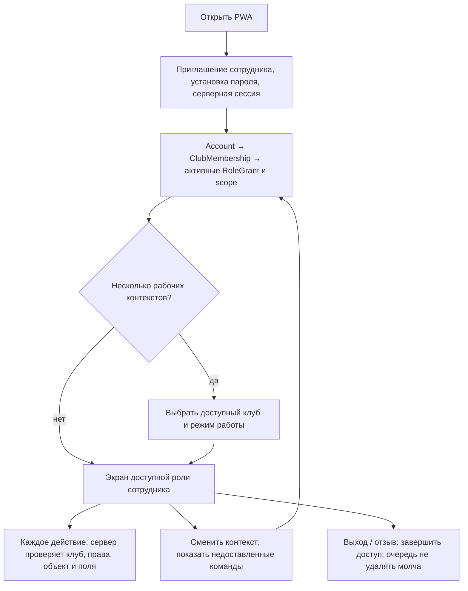
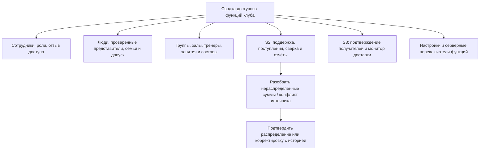
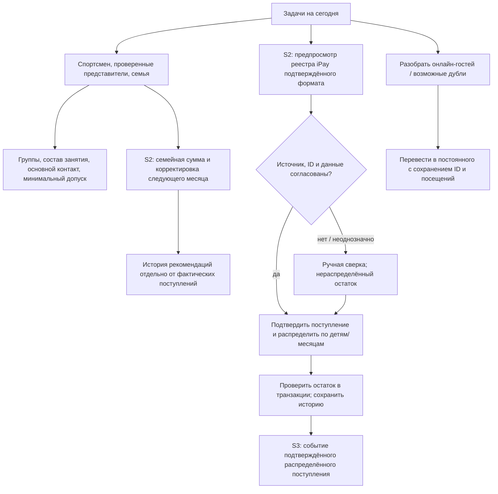
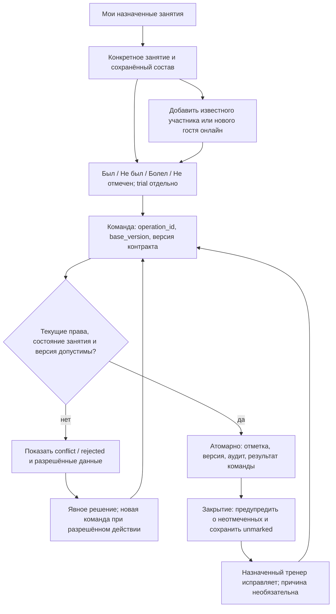
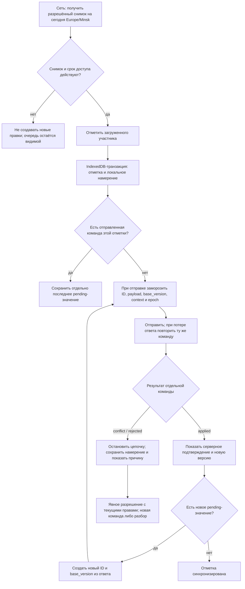
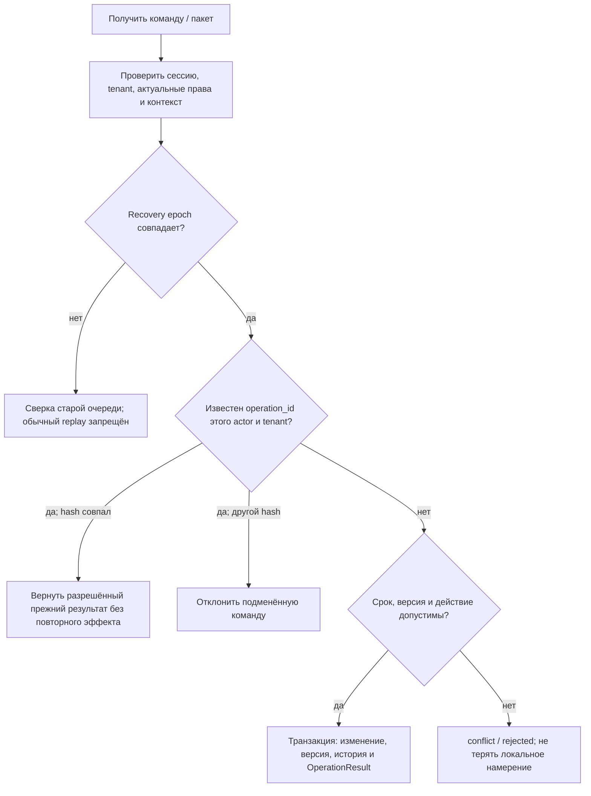
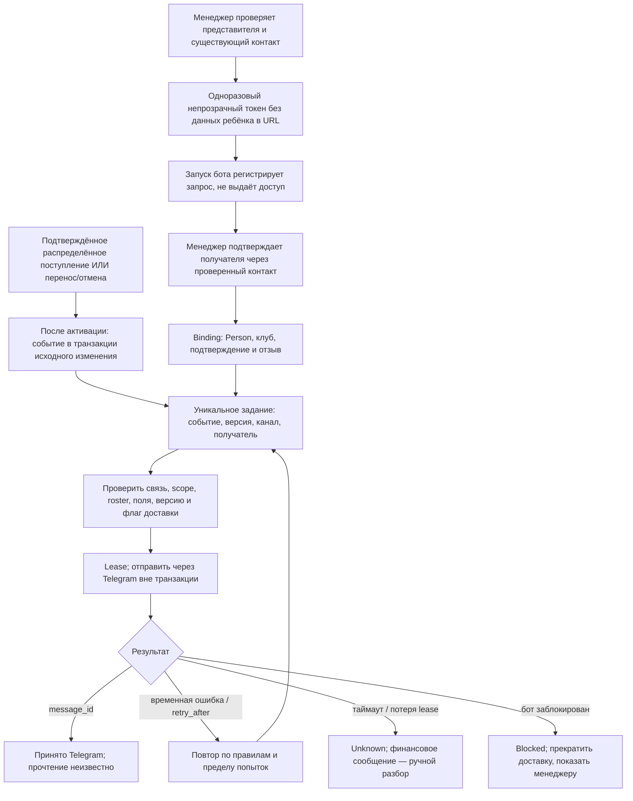
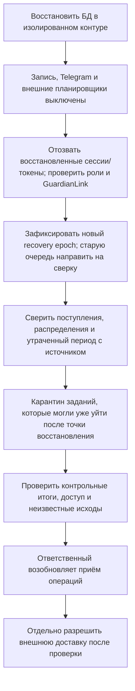
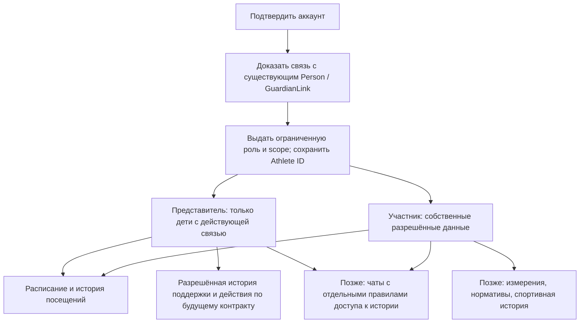
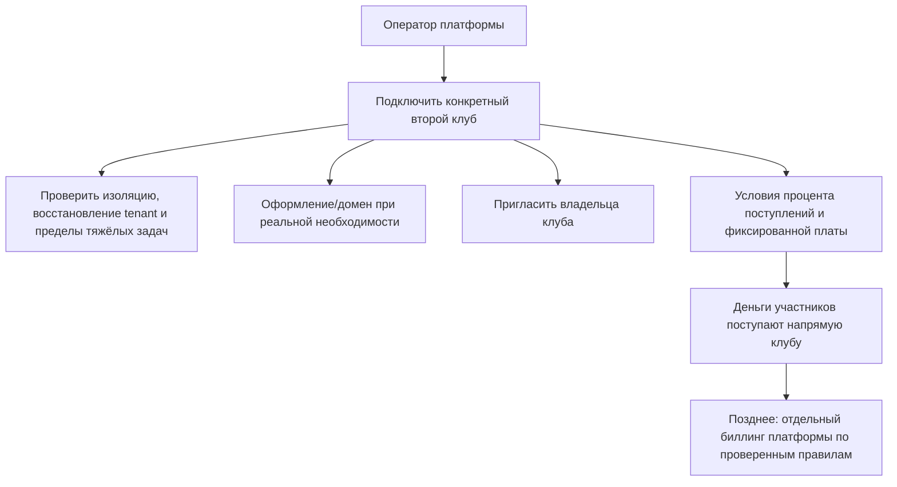

# Flow приложения JudeOS / Judo Pride

Версия 0.4 · 7 октября 2026 года. Сценарии согласованы с [архитектурой 0.4](ARCHITECTURE.md) и [планом MVP 1.1](MVP-DEVELOPMENT-PLAN.md). Это проектное описание; первоисточники D26–D63 недоступны. Первая версия — сотрудники. Кабинеты представителей/участников, чаты, спортивная история и биллинг платформы показаны только как последующее развитие.

Функции включаются по срезам: S0 — вход; S1 — люди/занятия/онлайн-журнал; S2 — поддержка; S3 — Telegram; S4 — офлайн; S5 — полный MVP в четырёх залах. Онлайн-пилот S1 не объявляется полным MVP и не обещает доставку или офлайн до их подключения.

## Вход и совмещение ролей

Активны администратор, менеджер и тренер; разрешения назначенных ролей объединяются. Переключатель меню не создаёт права. Account — вход, Person — профиль клуба, Athlete — спортивное участие; профиль может существовать без аккаунта. Вход родителя/участника в MVP выключен. Приглашения/восстановление одноразовые, секреты хешируются, ссылки передаются вручную через проверенный канал. Обязательная MFA не входит в baseline MVP.

Локальные данные и очередь разделены по аккаунту/клубу. При выходе, обновлении или смене аккаунта показываются неподтверждённые команды и путь синхронизации/явного удаления; другой аккаунт их не отправляет. Секрет сессии не хранится в localStorage/IndexedDB. Архивирование/отзыв прекращает доступ; последнего активного владельца нельзя удалить без передачи полномочий.

## Администратор клуба

Администратор работает в клубном scope; оператор платформы не получает неограниченного доступа к детям через эту роль. Административное закрытие занятия и точные действия с составом описываются отдельным правилом до реализации; пока занятие закрывает назначенный тренер. Отключение функции сохраняет данные, очередь и разрешённый путь разбора.

## Менеджер / сотрудник учёта

Менеджер ведёт людей, группы, занятия, финансы и импорт, но не выдаёт роли сотрудникам. Дополнительная произвольная роль бухгалтера не нужна для MVP. Семейные суммы 110/88/77/0 BYN задаются версией политики и порядком детей с периодом действия. Корректировка уменьшает уже рассчитанную сумму следующего месяца до минимума ноль. Отсутствие добровольной поддержки не создаёт долг и не ограничивает занятие.

Имя плательщика не создаёт представительство и не даёт права на данные. Повтор внешнего ID с другой суммой/валютой/статусом идёт на разбор. Без надёжного ID два похожих настоящих платежа не объединяются автоматически. Распределение и возврат блокируют одно поступление; исправление компенсирует эффект с историей, не удаляет деньги. Ни рекомендация, ни корректировка её суммы не запускают просьбу о поддержке в Telegram.

Новый гость создаётся онлайн без аккаунта. Схожие имя/телефон только предлагают дубль: менеджер подтверждает каноническую карточку, сохраняя старые ID и происхождение. Конфликт посещений, финансов или представительства останавливает связывание до разбора; права и логины не объединяются автоматически.

## Тренер и онлайн-журнал — S1

Тренер не управляет группой, не заменяет весь состав, не исключает участников, не переносит/отменяет занятие и не видит финансов через роль тренера. Доступны минимум данных занятия и телефон выбранного основного представителя. Допуск — операционное состояние без диагноза; недопуск не мешает зафиксировать фактическое присутствие.

Изменения разных спортсменов независимы. Закрытие не проставляет отсутствия; исправление сохраняет автора, время и до/после. Разовый визит не переводит спортсмена в другую группу. Перенос сохраняет Session ID и исходный ключ генерации; отмена сохраняет отметки и требует разбора, исключая занятие из обычного знаменателя отчёта. Исторический доступ бывшего тренера к контактам не выдаётся автоматически.

В S1 отсутствие сети блокирует запись с понятным сообщением. Локальное сохранение появляется только в S4. Посещаемость, включая закрытие и исправление, не отправляется в Telegram в MVP.

## Короткий офлайн и синхронизация — S4

Офлайн доступны только заранее загруженные данные и новые отметки текущего дня; первый вход/загрузка требуют сети. Новый человек, платежи и права офлайн не создаются. Известный участник вне состава добавляется одной атомарной `add-known-and-mark`: право добавления, участие при отсутствии и отметка с ожидаемой версией. Весь клуб не доступен в локальном поиске.

До первой отправки повторные нажатия можно свернуть. После отправки envelope неизменяем; на одну Attendance в одном хранилище максимум одна in-flight команда. Две вкладки координируются через IndexedDB, не память компонентов. Остальные спортсмены синхронизируются независимо от конфликта одной отметки. Ошибка локальной записи/квоты не показывается как успешное сохранение.

Автор и клуб определяются сервером. Context/snapshot ID и recovery epoch входят в request hash вместе с типом, target, payload и base_version. Snapshot не заменяет актуальную проверку полномочий. HTTP-успех пакета не означает применение всех строк: результат `applied/conflict/rejected` возвращается для каждой команды; отозванный доступ не раскрывает свежие данные или старый сохранённый ответ.

Смена суток/истечение снимка блокирует новые правки, сохраняя очередь. Предложения для контракта S4: до 7 дней от серверного снимка для неизвестной команды и 30 дней для полного OperationResult; окончательные сроки ещё фиксируются. После очистки полного ответа сохраняется ключ/хеш/ссылка на эффект либо старый контекст гарантированно отклоняется. Просроченная команда не становится новой автоматически. При другом epoch нужна сверка, даже если версия записи совпала.

Синхронизация запускается при открытии/возврате, восстановлении сети и вручную; background sync — улучшение. Service worker кэширует публичную оболочку, приватный минимум — в IndexedDB. Контакты/допуск не попадают туда без явного перечня полей; «болел» тоже защищаемые данные. Обновление сохраняет совместимость схемы очереди/команд и не заменяет оболочку посреди работы. Очистка браузера может уничтожить локальные данные; очередь не является резервной копией.

## Привязка Telegram и доставка — S3

Только два типа событий: распределённое подтверждённое поступление и перенос/отмена. Нет просьб о поддержке, уведомлений посещаемости или статуса болезни. Представитель одного ребёнка не получает общий семейный платёж с данными остальных без соответствующих прав. Правила частичных распределений, возвратов/исправлений и группировки закрепляются до включения финансовой доставки.

Пересланная ссылка не подтверждает право на ребёнка. Перед отправкой повторно проверяются GuardianLink и разрешённые поля; roster и новая версия переноса могут сделать старое задание неактуальным. Завершение проверяет lease token, старый worker не перезаписывает результат нового. Внешняя доставка не имеет гарантии exactly-once; для неизвестного исхода выбран явный порядок разбора/повтора.

До активации типа события уведомления не обещаны; включение и исторический импорт не запускают рассылку задним числом. Пауза сохраняет очередь; возобновление перепроверяет права и актуальность. Переносы могут включаться после S1, финансовые сообщения требуют S2.

## Отключение и восстановление

Пауза внешних эффектов задаётся конфигурацией запуска вне восстанавливаемой БД до старта процессов; тестовый restore не получает боевые отправляющие ключи. Старая БД не доказывает актуальность отзывов доступа за потерянный период: нужны независимый журнал или ручная проверка ответственным сотрудником; до неё соответствующий доступ закрыт. Уже отправленное сообщение не отменяется восстановлением БД. Процедура проверяется с отозванным доступом, отправленным сообщением и ожидающей офлайн-командой.

Отключение офлайн прекращает выдачу новых наборов, сохраняя экран и endpoint разбора. Отключение Telegram приостанавливает доставку, не удаляет задания. Изменение правил поддержки вводит новую версию с датой, исправление денег компенсирует операцию. Откат кода использует совместимую схему; восстановление БД не является обычной кнопкой отмены. Возврат зала в прежний процесс требует выгрузки/сверки дельты и одного источника учёта.

## Кабинеты представителя и спортсмена — после MVP

Возраст входа, восстановление, действия несовершеннолетнего и самостоятельные финансовые действия требуют отдельного решения. Семья для расчёта не выдаёт доступ; совпавшие имя/телефон не привязывают ребёнка автоматически. При чатах отдельно определяются выход из группы, смена представителя и видимость старой переписки; очередь уведомлений не становится хранилищем чата. Эти экраны и таблицы заранее не создаются.

## Уровень платформы — после MVP

Tenant-изоляция проверяется в MVP на двух синтетических клубах. Самообслуживание, биллинг, универсальные модули и общий SSO брендированных доменов сейчас не реализуются. Процент и фиксированная плата — направление монетизации, ставки/база/возвраты и удержание iPay не считаются установленными. Доступ оператора к данным клиентов требует ограниченной процедуры поддержки и аудита.

## Согласование с HTTP-контрактом

Backend использует Go + net/http + chi v5 ([ADR 0004](adr/0004-chi-and-api-documentation.md)). Изменения описанных здесь данных, сценариев, прав и эксплуатационного поведения отражаются в соответствующих endpoint’ах OpenAPI и реестре в том же PR. Служебные и интеграционные маршруты также учитываются; Swagger UI отображает машиночитаемый контракт. Единые требования и проверки — [правила API](../docs/API-DOCUMENTATION.md).
