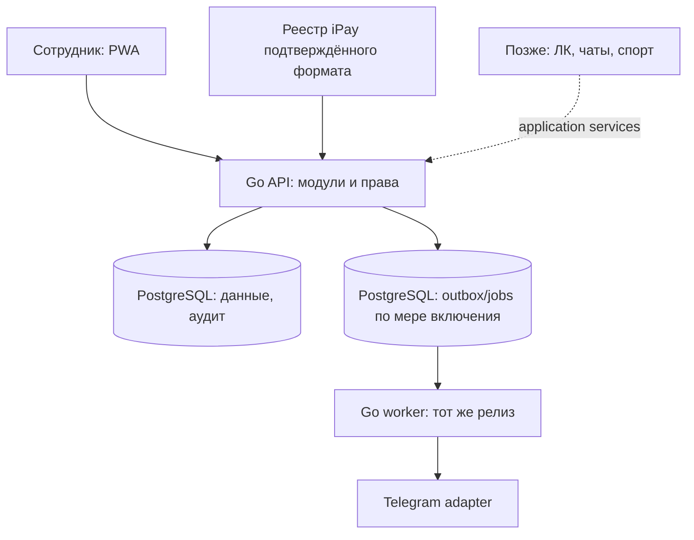

# Архитектура JudeOS / Judo Pride

Версия 0.4 · 7 октября 2026 года · исправленная рекомендация к реализации.

Основание: два предоставленных документа, более ранние материалы проекта в доступном checkout и [исследование спортивных CRM](CRM-RESEARCH.md). Это проектное решение, а не описание существующего приложения. Изменения и приоритеты — [критический разбор](ARCHITECTURE-REVIEW.md), порядок реализации — [MVP-DEVELOPMENT-PLAN.md](MVP-DEVELOPMENT-PLAN.md). Оригиналы сохранены в каталоге archive/2026-10-07-inputs.

Правила, прямо изложенные в приложенном плане 1.0, приняты за рабочий продуктовый baseline при расхождении с архитектурой 0.3. Ссылки этого плана на D26–D63, MVP-INTERVIEW и ADR нельзя независимо проверить по предоставленным материалам: доступный DECISIONS содержит только D01–D25. Новые решения ниже — рекомендации настоящего пересмотра, не дополнительные подтверждения пользователя.

## 1. Проект и минимальный фундамент

Judo Pride — клуб с четырьмя залами; ориентир — 1000 участников и 500 представителей, а не одновременных пользователей. JudeOS должен заменить рабочие таблицы сотрудников: люди и семьи, занятия, посещаемость, добровольная поддержка, фактические поступления, информирование родителей. Позже тот же продукт развивается в сервис для других клубов, личные кабинеты, чаты и спортивную историю.

Сохраняем React/TypeScript/PWA, Go и PostgreSQL. Один репозиторий, модульный монолит, один общий выпуск. В первой рабочей части достаточно web + API + PostgreSQL; worker из того же backend включается с долговременными импортами и уведомлениями. Разделение процессов — способ выполнять фоновые задачи, не микросервисная архитектура.

Телефон/PWA — основной пользовательский интерфейс, включая тренера во время занятия и владельца; desktop/планшет сохраняются. [Перспектива пошаговой переклички](MOBILE-COACH-UX.md) влияет на разделение представления и команд: список и будущие карточки используют те же идентификаторы, права, аудит и контракт отметок. Жесты не требуют отдельного API или новых таблиц; заметки не моделируются без согласования. Это не переносит офлайн S4 в первый онлайн-срез.

Основа расширения: стабильные идентификаторы, явные связи людей, история занятий и денег, серверные права, понятные владельцы таблиц, версионируемые миграции. Не создавать пустые таблицы будущих модулей, универсальную систему событий, конструктор полей, плагинов или процессов. Наличие будущих чатов не требует WebSocket в MVP.

## 2. Границы MVP

| В полном MVP | После MVP |
|---|---|
| Кабинеты администратора, менеджера и тренера; совмещение ролей | Кабинеты представителей и участников |
| Профили, проверенные связи представителей, семейные условия | CRM заявок, продажи и самообслуживание других клубов |
| Несколько залов, групп и тренеров; конкретные занятия и составы | Сложный booking, листы ожидания, турниры, мерч |
| «Был», «Не был», «Болел», «Не отмечен»; пробное посещение отдельным признаком | Другие статусы только после нового предметного решения |
| Закрытие и исправление посещаемости, аудит; причина исправления необязательна | Обязательная MFA, если отдельно включена в следующий выпуск |
| Новый гость онлайн; известный заранее загруженный участник офлайн | Создание нового человека офлайн |
| Минимальный допуск без диагнозов и файлов; недопуск не запрещает записать факт присутствия | Медицинские документы и отдельный проект их обработки |
| Добровольная поддержка, поступления, распределения, возвраты | Биллинг платформы, эквайринг, автоматические списания |
| Telegram: подтверждённое распределённое поступление; перенос/отмена | Сообщения о посещении, push/email/SMS, внутренние чаты |
| Офлайн расписание и отметки только на сегодня в Europe/Minsk | Расширенный офлайн и дополнительные устройства |
| Импорт конкретных исходных таблиц/реестра, согласованные отчёты | Универсальный конструктор импорта/BI |

Ранний пилот онлайн-журнала проверяет полезность первой части, но не заменяет приёмку полного MVP. Условия работы с реальными данными и восстановления действуют уже для этого пилота. Все численные эксплуатационные цели и новые технические параметры ниже — проверяемые предложения.

## 3. Стек, модули и зависимости

| Компонент | Решение |
|---|---|
| Web | React + TypeScript + Vite; TanStack Query для серверных данных; текущая дизайн-система Judo Pride |
| Offline | IndexedDB, например Dexie; service worker для публичной оболочки, добавляется отдельным срезом |
| API | Go, net/http + chi v5 для маршрутизации, application services; явная передача транзакции |
| SQL | PostgreSQL, pgx/sqlc как исходная рекомендация; SQL-миграции |
| Контракт | REST /api/v1, OpenAPI как источник контракта, Swagger UI и генерируемый TS-клиент; реестр всех endpoint’ов, контракт обновляется вместе со срезом |
| Размещение | Контейнеры и Compose, один origin web/API; конкретные ресурсы после замеров |

Структура: `apps/web`, `cmd/api`, `cmd/worker` по мере необходимости, `internal/{access,people,training,attendance,contributions,notifications}`, узкий `internal/platform`, `db/migrations`, `api/openapi`, `ops`. Не создавать repository/interface на каждую таблицу. Интерфейсы нужны прежде всего у реально заменяемых адаптеров: источник поступлений, доставка сообщения, часы в расчётах.

Владельцы данных:

| Модуль | Ответственность | Разрешённые зависимости |
|---|---|---|
| access | Account, сессии, ClubMembership, RoleGrant, проверка scope | Узкие общие типы |
| people | Person, Athlete, GuardianLink, Household, Admission | access для прав; не финансы/уведомления |
| training | Venue, Discipline, Group, Enrollment, Session, Roster, назначения тренеров | people через сервис проверки участника |
| attendance | Attendance и история исправлений | training и people; не Telegram |
| contributions | Политики, рекомендации, поступления и распределения | people; не attendance для автоматического «долга» |
| notifications | Привязка получателя, доставка, выбор разрешённых сообщений | Минимальные данные источника и проверка people/access |

Модуль меняет собственные таблицы; межмодульная команда вызывает явные сервисы в одной транзакции. Чтение нескольких модулей для конкретного отчёта допустимо через согласованный SQL/read model с теми же правами. Не превращать все чтения в цепочки удалённых запросов. Циклические импорты пакетов и запись в чужие таблицы — предмет обычного code review.

Внутренние синхронные вызовы остаются обычными функциями. Outbox применяется там, где после commit нужен внешний эффект. Это не event sourcing: основное состояние хранится в обычных таблицах, история — отдельными записями.

## 4. Идентичность, семья и полномочия

Первый wire-контракт S0-01 [принят в #16/PR #78](../api/README.md): границы/словарь, вход, назначенное занятие и одна отметка. [ADR 0006](adr/0006-first-online-contract.md) имеет статус **принят** по DECISIONS U2026-10-07-S0-01; принятие контракта не означает работающий предметный backend. Он не задаёт полный API S1–S4, права исторических контактов или финансы. Машиночитаемый контракт и примеры — в api/openapi; владение данными и межмодульные зависимости из §3 сохраняются.

- **Account** — глобальный способ входа. **ClubMembership** связывает аккаунт с клубом; **RoleGrant** задаёт фиксированную роль и область. Совпадение телефона не объединяет профили клубов.
- **Person** — профиль человека внутри клуба. Его связь с Account необязательна; в клубе один аккаунт не подменяет профили нескольких детей. Человек может одновременно быть тренером и представителем.
- **Athlete** — участие Person в тренировочном процессе, со стабильным ID; не логин, не абонемент, не юридическое членство организации. Формальное членство добавляется отдельно, когда требуется.
- **GuardianLink** — проверенная связь представителя с конкретным участником: статус, основание проверки, период действия и разрешённые категории информации. Несколько представителей и несколько детей допустимы.
- **Household/HouseholdMember** — группа для расчёта семейных условий с периодами и порядком детей. Она не выдаёт права на просмотр. Плательщик может не быть представителем; финансовый импорт не создаёт GuardianLink.
- **Admission** — ограниченный операционный результат «допущен / не допущен / требует проверки», срок и автор; без диагнозов. Его история не заменяет посещаемость.

Минимальные поля первого среза предлагаются отдельно в спецификации: технический ID, отображаемое имя, состояние участия, связи с группами и представителями; контакт представителя только по рабочей необходимости. Точный список полей D54 недоступен: это нельзя выдавать за полное покрытие согласованной карточки. Дата рождения хранится как дата, если её необходимость подтверждена; будущие возрастные нормативы потребуют достоверной даты, которую нельзя восстановить из возраста «сейчас».

Три активные роли MVP. Администратор управляет сотрудниками; менеджер ведёт людей, группы, занятия, финансы и импорт; тренер работает с назначенными занятиями. Тренер может добавить известного участника или онлайн-гостя, но не заменяет состав целиком, не исключает участников, не переносит занятие и не видит финансов. Ему доступен только согласованный основной контакт участника своего занятия. Административные права закрытия и порядок замены основного контакта уточняются локальной спецификацией, без расширения прав по умолчанию.

Фиксированные будущие обозначения ролей parent/athlete допустимы; выдавать эти роли, приглашать родителей в кабинет или делать интерфейс этих кабинетов в MVP не нужно. Доступ проверяется по действию, клубу, объекту и разрешённым полям. Смена режима меню не меняет полномочия. API, поиск, экспорт, worker и офлайн-синхронизация проходят те же проверки.

Будущая активация ЛК: подтвердить аккаунт → отдельно доказать связь с существующим Person/GuardianLink → выдать ограниченный доступ. Не создавать нового Athlete и не искать ребёнка автоматически по одному телефону/ФИО. Этот принцип соответствует продуктовым сценариям семей в Gymdesk/TeamUp, но схема данных — наша рекомендация; см. [исследование](CRM-RESEARCH.md).

## 5. Изоляция и вход

Каждая клубная таблица содержит tenant_id, включая операции, аудит, импорт и задания. Глобальные Account/AuthSession не содержат профилей детей. Tenant выбирается сервером из разрешённого контекста; параметр клиента не является разрешением. Runtime не имеет BYPASSRLS, не владеет таблицами и не выполняет миграции.

RLS с USING/WITH CHECK защищает границу клуба; отсутствие контекста закрывает доступ. Tenant-контекст устанавливается локально в каждой транзакции, не остаётся на соединении пула. Роли миграций и резервирования отделены. Составные FK `(tenant_id, referenced_id)` и соответствующие уникальности исключают межклубные связи; проверки FK/уникальности обходят RLS, поэтому один RLS их не заменяет. [PostgreSQL: RLS](https://www.postgresql.org/docs/current/ddl-rowsecurity.html).

RLS не является полной системой прав тренера внутри клуба и не защищает от произвольного исполнения SQL с полномочиями runtime. Обязательны параметризованный SQL, серверный scope и негативные проверки двух синтетических клубов. До второго реального клуба — проверка всех путей доступа, ограничений тяжёлых задач, экспорта и восстановления одного tenant.

Реализация синтетической основы #20 — [ADR 0008, предложено для ревью](adr/0008-tenant-isolation-and-audit.md): явный локальный bootstrap, отдельные LOGIN migrator/runtime и NOLOGIN audit_reader; Club, синтетические объекты с составным FK и метаданные аудита. Полный контекст проверяется application boundary до SQL; PostgreSQL policy требует tenant при обращении к строкам. API readiness дополнительно отвергает привилегированную runtime credential. Логи связываются серверным request_id и содержат только route pattern/status/duration/безопасный code, без URL/query/контактов/секретов. Аудит атомарный и недоступен runtime для чтения/изменения; читатель аудита — отдельная техническая capability, не подтверждённая продуктовая роль. Срок синтетического аудита — жизнь disposable БД/тома до явного сброса; числовые реальные сроки/права/основания определяются в #18/#24. Auth, права внутри клуба и предметные команды остаются отдельными задачами.

Вход сотрудников: приглашение и самостоятельная установка пароля, безопасное хеширование поддерживаемой библиотекой, серверная отзываемая сессия; одноразовые короткоживущие ссылки передаются вручную по проверенному каналу. Хранить хеши секретов сессии/ссылок; cookie Secure/HttpOnly/host-only, защита CSRF/Origin, rate limit входа, нейтральные ответы восстановления. Отзыв/архивирование прекращает сессии и доступ. Нельзя удалить/лишить роли последнего активного владельца без передачи полномочий.

Публичные приглашения, восстановление и callback получают клуб из проверенного host/config, интеграционной credential или непрозрачного токена через узкий технический реестр. Реестр не содержит детских профилей. После разрешения tenant используется обычная tenant-транзакция; для bootstrap не выдаётся BYPASSRLS и не принимается tenant из неподтверждённого payload.

Обязательная MFA исключена из baseline MVP согласно позднему плану; отдельное усиление не препятствует архитектуре. Не хранить bearer-токены в localStorage/IndexedDB. Один origin достаточно для пилота. Общий SSO между брендовыми доменами пока не реализуется.

## 6. Занятия, история и дубли

Group — организационная группа; Enrollment — участие с периодом `[from, to)`; Session — конкретное занятие; Roster — зафиксированный состав; GroupCoach/SessionCoach — несколько назначенных тренеров. Участник может состоять в нескольких группах.

Простое недельное расписание порождает занятия на ограниченный горизонт; произвольный редактор recurrence не нужен. Ключ генерации относится к устойчивому шаблону и исходному слоту. Перенос сохраняет Session ID и исходный ключ: повторная генерация не воссоздаёт старое занятие. Время события — UTC, зона клуба — Europe/Minsk, месячный период поддержки — локальная календарная дата/месяц.

Перевод между группами не меняет прошлые roster и посещения. Изменение будущего расписания явно задаёт дату вступления и набор затрагиваемых занятий; занятия с фактом посещения не переписываются массово. Одновременное редактирование roster/назначения/состояния Session проверяет версию. Архивирование исключает новые назначения, сохраняет историческое представление.

Предлагаемая машина состояний Session: planned → in_progress → closed; отмена отдельным действием менеджера/администратора. Отмена занятия с отметками сохраняет записи, требует явного разбора и исключает его из обычного знаменателя отчёта; это не массовое удаление посещений. Закрытие предупреждает о неотмеченных и сохраняет их. Исправление после закрытия разрешено в согласованной области, с автором, временем и прежним/новым значением; обязательной причины нет.

Attendance уникальна по `(tenant, session, athlete)`, имеет `status`, `version`, `recorded_at`, автора. `unmarked` не равно `absent`; `trial` — отдельный признак участия. Обновления разных детей независимы. Два изменения одной отметки сравнивают base_version; второе получает конфликт, а не незаметно перезаписывает первое.

Онлайн-гость — тот же Athlete с временным операционным состоянием и без Account, а не отдельная несовместимая сущность. Превращение гостя в постоянного сохраняет ID и историю. При обнаружении уже существующего спортсмена менеджер подтверждает связь: старый ID сохраняется как ссылка на канонический, посещения и финансовые связи не теряются. Совпадение ФИО/телефона только кандидат.

Минимальный разбор дубля должен остановиться при конфликтующих отметках одного занятия, финансовых связях или спорном представительстве. Разрешение фиксируется в аудите, исходные ID и происхождение сохраняются. Права представителей/логины не объединяются автоматически. Универсальный редактор массового merge/unmerge откладывается; ошибочное связывание исправляется контролируемой операцией с проверкой уже появившихся зависимостей.

## 7. Добровольная поддержка и поступления

Сохраняем три независимых понятия: рекомендация суммы, факт поступления, распределение по детям/периодам. Отсутствие поддержки не создаёт долг и не блокирует посещение или допуск. Практики платных абонементов CRM нельзя механически переносить на этот процесс.

Из позднего плана: месячные суммы 110 / 88 / 77 / 0 BYN для первого / второго / третьего / четвёртого и последующих детей; порядок задаёт менеджер. Правила и состав семьи имеют период действия. Корректировка уменьшает уже рассчитанную семейную сумму следующего месяца, минимум — ноль; изменение прошлого периода выполняется явно с историей. Числа хранятся в версии политики, а не дублируются константами UI и backend.

Деньги — целые минимальные единицы, валюта обязательна; float не используется. MVP работает с BYN, без валютных конверсий. У каждой рекомендации — период, получатель, версия политики, исходная сумма и корректировки, чтобы результат воспроизводился после изменения семьи.

Receipt фиксирует подтверждённый источник, сумму, валюту, дату события, внешний ID и сведения плательщика только при наличии. ReceiptAllocation связывает часть денег с Athlete/месяцем. Представительство не выводится из имени плательщика. Неопознанная/нераспределённая часть видна отдельной суммой.

Инварианты проверяются в одной транзакции с блокировкой Receipt:

- Сумма действующих распределений не больше подтверждённой суммы за вычетом подтверждённых возвратов; суммы неотрицательны, валюты совпадают.
- Два менеджера не могут одновременно использовать один остаток. Все пути, включая импорт и job, применяют этот протокол.
- Подтверждённое поступление не удаляется и не редактируется незаметно. Возврат, отмена источника и исправление — связанные записи с автором/причиной и внешним подтверждением, если применимо.
- Если возврат затрагивает распределённые деньги, нужные распределения компенсируются в той же операции; история сохраняется. Не создавать необъяснимый отрицательный остаток.

Сверка различает деньги, полученные за календарный период, и деньги, отнесённые к месяцу поддержки: это разные измерения. Контрольное равенство для согласованной выборки поступлений: чистые подтверждённые поступления = действующие распределения + нераспределённый остаток. Рекомендации в это равенство не входят.

### Обмен iPay

В MVP — один адаптер реально подтверждённого источника. Предоставленный [PDF и разбор](../docs/integrations/ipay/README.md) описывают входящий XML/POST от iPay: ServiceInfo → TransactionStart → TransactionResult, отдельно StornStart/StornResult. Это описание on-line протокола, а не формата реестра. Его актуальность и активация у клуба, подпись, индивидуальные номера, договорная область ID и банковское зачисление ещё требуют подтверждения. Реальный режим выбирается по договору; синтетический формат не является готовой интеграцией.

Для реестра поток сохраняется: принять ограниченный файл → сохранить ImportBatch/строки и происхождение → проверить → нормализовать → предложить сопоставление → подтвердить/распределить → аудит и событие, если уведомления включены. Для подключённого входящего on-line сообщения проверяется подлинность и долговременно сохраняется вход до сетевого подтверждения. Сумма/валюта сохраняются при TransactionStart, но поступление не подтверждается до успешного TransactionResult; HTTP 200 означает доставку. RequestId общий для нескольких типов сообщений и не является ключом поступления. Ответ на TransactionResult не допускает Error. StornStart не подтверждает возврат; результат Storned=Y требует компенсирующего учёта. Детали обработки повторов, сбоев и сверки предложены в [ADR 0003](adr/0003-ipay-inbound-payment-protocol.md), статус «предложено»; исполняемый контракт/миграции появятся после согласования профиля.

Уникальность поступления определяется `(tenant, provider account, external operation ID)` в документированной области. При повторе ID с иной суммой/валютой/статусом вход не игнорируется: это конфликт или корректировка источника для разбора. Если ID нет, отпечаток строки — подсказка; два одинаковых настоящих платежа не схлопываются автоматически. Повтор того же файла/строки блокируется идентичностью пакета; повтор в другом реестре без надёжного ID требует сверки менеджером.

Импорт людей и платежей имеет общие небольшие утилиты чтения/результата строк, но разные предметные правила. Фиксированный шаблон + dry run + сопоставление колонок под согласованный источник достаточно; универсальный конструктор mapping, постоянная синхронизация Sheets и собственный ETL не нужны. Каждая строка хранит source key и итог; повторяемость и проверка итогов обязательны.

## 8. Telegram и фоновые задачи

Уведомления подключаются после рабочих предметных операций. До их включения ранний пилот явно работает без доставки; исторический импорт и включение модуля не запускают рассылку задним числом. После включения изменение данных и outbox фиксируются одной транзакцией.

Один PostgreSQL outbox/jobs для необходимых эффектов; inbox требуется для действительно принимаемых внешних сообщений, ImportBatch уже является долговременным входом файлов. Не дублировать один и тот же реестр в нескольких универсальных очередях. Job: tenant, тип, ссылка на событие/версию, получатель, попытки, next_attempt, lease, status. Уникальность события/версии/канала/получателя предотвращает повторное создание задания.

Worker использует короткий `FOR UPDATE SKIP LOCKED`, фиксирует lease, завершает транзакцию и только затем вызывает сеть. Завершение проверяет актуальный lease token: старый worker не перезаписывает результат нового. Просроченная lease возвращается в обработку; backoff, предел попыток, blocked/unknown/manual видны сотрудникам. Tenant-обход выполняется по безопасному реестру клубов с отдельными транзакциями и ограничением тяжёлых задач.

Привязка Telegram: менеджер предварительно проверяет представителя → выдаёт одноразовый непрозрачный токен → /start регистрирует запрос → менеджер подтверждает получателя через уже проверенный контакт. Пересланный токен сам по себе не выдаёт доступ. Можно реализовать другой доказуемый способ подтверждения, но не «владеет ссылкой — значит родитель». Binding относится к Person и клубу, не к семье целиком.

Только два типа сообщений:

1. Подтверждённое и распределённое поступление — разрешённым представителям соответствующего ребёнка. Полный семейный платёж не раскрывается человеку, имеющему права только на одного ребёнка; текст отражает только его разрешённую часть. Несколько частичных распределений и последующая корректировка имеют явную версию/правило сводки.
2. Перенос/отмена — актуальным уполномоченным представителям затронутого состава. Задание хранит версию события; старый перенос не отправляется после нового изменения. Изменившийся roster также требует проверки получателей.

Перед фактической отправкой снова проверяются связь, разрешённые поля, состояние модуля и актуальность события. Имена, контакты, медицинские сведения и сырые финансовые реестры не помещаются в ссылку. Диагнозы и статус болезни в Telegram не отправляются.

Успех sendMessage означает приём Telegram, не прочтение. После сетевого таймаута или потери lease исход может быть неизвестен; Telegram Bot API не предоставляет здесь гарантии exactly-once. Рекомендация MVP: финансовый unknown — ручной разбор, остальные повторные доставки по явной политике с предупреждением о возможном дубле; ограничения retry_after соблюдаются. [Telegram Bot API](https://core.telegram.org/bots/api).

## 9. Команды, короткий офлайн и конкуренция

Контракт изменения посещаемости задаётся уже для онлайн-журнала: `operation_id`, тип команды, target, payload, base_version, версия контракта. Автор и tenant определяются сервером из текущей сессии. Идемпотентность охватывает `(tenant, actor, operation_id)`, хеш включает тип/target/payload/base_version. Та же команда возвращает исходный результат; другой payload с тем же ID отклоняется. Сохранение результата операции, отметки, версии и аудита атомарно; конкурентные повторы сериализуются уникальным ключом.

Повтор проверяется после аутентификации и действующих прав; сохранённый ответ не становится каналом доступа после отзыва. Batch содержит независимый итог каждой команды `applied/conflict/rejected`, HTTP-успех пакета не означает успех всех строк. Внешний провайдер использует собственные ключи идемпотентности, не account ID сотрудника.

Офлайн добавляет локальную очередь к этому контракту. Cache API хранит оболочку и публичные ресурсы; минимальный рабочий набор IndexedDB разделён по аккаунту/клубу. Сегодня определяется зоной Europe/Minsk и последним серверным контекстом. Платежи, создание нового человека, изменение прав и медицинские файлы офлайн не доступны. Для гостевого визита известный спортсмен должен быть заранее загружен в разрешённом scope. Для известного гостевого участника используется одна атомарная команда add-known-and-mark: проверить право добавления, создать участие при его отсутствии и сохранить отметку. Конкурентное существующее участие/отметка проверяется по ожидаемой версии; молчаливого перезаписывания нет. Общий граф зависимостей офлайн-команд не нужен.

Контакты и допуск не кэшируются без явного перечня разрешённых полей. Статус «болел» тоже требует включения в состав защищаемого офлайн-набора. Сохраняются snapshot/version и свежесть; истёкший или вчерашний набор не разрешает новые локальные изменения. Очередь вчерашних команд остаётся видимой и не удаляется.

### Несколько изменений одной отметки

На одну Attendance в одном локальном хранилище допускается не более одной отправленной, но не подтверждённой команды. Координация вкладок — через транзакцию/блокировку IndexedDB, а не только память компонента.

До первой отправки повторные нажатия сворачиваются в итоговое локальное намерение. При отправке envelope замораживается; повторяется тот же ID и payload. Если тренер изменил статус во время отправки, новое желаемое значение хранится отдельно и после ack получает новый ID/base_version из ответа. Нельзя отправлять две собственные правки с одной исходной версией или изменять payload уже отправленной команды.

При conflict или rejected цепочка этой отметки останавливается, показываются актуальное серверное значение и локальное намерение; явный выбор пользователя создаёт новую команду. Другие дети синхронизируются независимо. Нужны проверки: два тренера, две вкладки, потерянный ответ, атомарное добавление известного участника с отметкой, отмена/перенос/архив/отзыв доступа. Время устройства не определяет победителя.

### Сроки и обновления

Офлайн-envelope дополнительно содержит выданный сервером context/snapshot ID и recovery epoch; оба входят в неизменяемый request hash. Сервер может проверить выдачу, время и область этого контекста. Контекст не выдаёт полномочия сам по себе — актуальные права проверяются заново.

Не путать окно данных «сегодня» с допустимым сроком доставки накопленных команд. До запуска S4 нужно задать срок автоматического применения ещё неизвестной серверу команды и срок сохранения OperationResult; второй не меньше первого плюс эксплуатационный запас. Исходное предложение: применение неизвестной команды до 7 дней от выданного сервером снимка, полный ответ операции 30 дней; окончательные числа закрепляются контрактом. Срок проверяется по серверному контексту, не произвольному client timestamp. Для уже известного ID допустим возврат сохранённого результата после этого срока при действующих правах и том же recovery epoch; повтор не выполняет изменение снова. При смене recovery epoch сначала требуется сверка, а не обычный replay.

После удаления полного ответа остаётся минимальный ключ/хеш и ссылка на эффект на срок сохранения соответствующего учёта либо старый контекст гарантированно отклоняется. Истёкшая команда не превращается в новую операцию автоматически: сохраняется локально для ручного разбора. Нельзя очистить ключи и затем применить старые повторы повторно.

Синхронизация при открытии, возврате, восстановлении сети и вручную; background sync — улучшение. Локальное подтверждение и подтверждение сервера визуально различаются. Ошибка квоты не показывает сохранение; браузер может удалить данные, поэтому офлайн не даёт гарантии резервной копии. [MDN: хранение и вытеснение](https://developer.mozilla.org/en-US/docs/Web/API/Storage_API/Storage_quotas_and_eviction_criteria).

Выход/смена аккаунта/обновление показывают недоставленные команды и путь синхронизации или явного удаления; другой аккаунт не отправляет их от своего имени. Service worker не активирует несовместимую оболочку посреди работы. IndexedDB мигрируется; сервер принимает поддерживаемую предыдущую версию команд в пределах согласованного окна. Неизвестная версия не пропадает, а требует обновления/разбора.

## 10. Обратимость и эксплуатация

Обратимость означает отдельно: выключить функцию, вернуть код, исправить данные, восстановиться после аварии. Это четыре разных процедуры.

| Изменение | Как ограничить и отменить | Что нельзя обещать |
|---|---|---|
| Telegram | Серверный флаг доставки; pause jobs, очередь сохраняется, включение без автоматического replay истории | Уже отправленное сообщение не «откатывается» базой |
| Offline | Остановить выдачу новых наборов; сохранить экран и endpoint разбора очереди | Выключение меню не разрешает удалить накопленные отметки |
| iPay parser | Версия parser + исходные строки + dry run; отключение автоматического сопоставления, ручной разбор | Повтор parser не создаёт второй Receipt; подтверждённые деньги не откатываются удалением |
| Семейное правило | Новая версия с датой вступления, предварительный расчёт, явные корректировки | Пересчёт сегодняшними правилами не заменяет историю |
| Код/SQL | Expand → переход кода → contract после окна совместимости; предыдущий релиз совместим с расширенной схемой | Down-migration с удалением данных не считается безопасным откатом |
| Ошибка сотрудника | История + корректирующая операция с текущими правами и проверкой зависимостей | Общая кнопка «отменить всё» после внешних эффектов не гарантируется |

Для MVP достаточно нескольких явных переключателей конфигурации на сервере. Каждый имеет владельца, условие выключения и дальнейшую судьбу; полноценная feature-flag платформа не нужна. Флаг интерфейса не заменяет серверный запрет операции. Формат ядра нельзя произвольно переключать флагом между несовместимыми состояниями.

Стартовая инфраструктура выбирается по бюджету и допустимому восстановлению: одна VM может обслужить ограниченный пилот, API/worker/DB могут быть разнесены позже без смены предметной модели. Две VM сами по себе не дают высокой доступности. Redis, Kafka, Kubernetes, отдельная аналитическая БД не входят в текущий план.

До любого реального пилота: HTTPS, закрытая БД, отдельные runtime/миграционные роли, секреты вне репозитория, синтетическое тестовое окружение, назначенный ответственный, резервные копии вне диска приложения и проверенное восстановление. Состав данных детей, «болел», допуск, контакты, Telegram, офлайн-копии, сроки хранения и контур размещения проверяются для конкретного оператора и РБ. Настоящий документ не подтверждает юридическое соответствие и не выбирает провайдера.

RPO/RTO выбираются до соответствующего пилота. Если выбран RPO 15 минут, ежедневный dump недостаточен: нужны подходящая частота/механизм резервирования, например база + WAL, мониторинг и реальная проверка. RTO включает восстановление приложения, конфигурации, проверку денег и возобновление интеграций. [PostgreSQL: PITR](https://www.postgresql.org/docs/current/continuous-archiving.html).

### Возврат после аварии с потерей данных

1. Восстановить в изолированном контуре с выключенными отправкой Telegram, приёмом новых записей и планировщиками внешних эффектов. Секрет/конфигурация запуска не должны автоматически разрешать отправку восстановленной очереди.
2. Проверить состояние ролей, отзывов сессий и GuardianLink после точки восстановления: восстановление старой БД может вернуть отозванный доступ. Отозвать восстановленные сессии и одноразовые invite/reset/Telegram-binding токены. Актуальные RoleGrant/GuardianLink и запреты потерянного периода восстановить по независимому журналу или ручной проверке ответственным сотрудником; старая БД сама не может доказать их актуальность. До проверки доступ соответствующих лиц закрыт.
3. Зафиксировать новый recovery epoch для команды/снимка офлайн; очереди из прежнего состояния требуют сверки, даже если номер версии случайно совпал. Не применять старое локальное состояние к откатившейся истории автоматически.
4. Повторно сверить iPay с последней достоверной точки, используя внешние ID. Без надёжных ID требуется ручной разбор; отсутствие последнего импорта не означает отсутствие реального поступления.
5. Отправленные после восстановленной точки сообщения могли реально уйти. Такие задания карантинируются и разбираются, а не просто получают retry. Зафиксировать неизвестные исходы; локальная БД не доказывает недоставку.
6. Сверить контрольные итоги, восстановить приём операций и отдельно разрешить внешние отправки. Зафиксировать фактические потери и время, включая ручной разбор.

Это короткий runbook и несколько проверок состояния, а не отдельная система disaster recovery. Похожая процедура нужна после ошибочной массовой миграции. Restore тестируется с уже отправленным сообщением, отзывом доступа и ожидающей офлайн-командой.

Наблюдаемость: ошибки/время API, неизвестные исходы доставки, возраст очереди, свежесть импортов/копий, нераспределённые суммы, конфликты, свободный диск. Логи — идентификаторы без полных реестров/контактов/медицинских данных. Аудит ограничен доступом и сроком; архивирование не означает бессрочное хранение. Экспорт проверяет права и при формировании, и при выдаче результата; временные файлы имеют срок жизни.

## 11. Расширение без преждевременной реализации

| Будущий модуль | Что достаточно сделать сейчас | Что добавляется при подтверждённой потребности |
|---|---|---|
| ЛК представителя/участника | Разделить Account/Person/Athlete, проверенные GuardianLink, scope | Приглашения в ЛК, самостоятельные действия, отдельные правила для несовершеннолетних |
| Чаты | Не смешивать сообщения с jobs; stable person/group/session IDs | Conversation, Membership с историей, Message, редактирование/удаление, правила доступа к старой истории, модерация/блокировка, затем realtime |
| Нормативы и физические измерения | Стабильный athlete_id, даты, история исправлений | MetricDefinition, единица/точность/методика, Measurement с measured_at/recorded_at/автором, отдельная поправка, версия Standard |
| Пояса/разряды | Не хранить единственное универсальное поле «рейтинг» в Person | RankAward/Promotion: дисциплина, дата, критерии, история отмен/исправлений |
| Рейтинги | Достоверные факты посещений; не смешивать их с оценкой спорта | Версии правил, сравнимая дисциплина/возраст/методика, дата среза, воспроизводимый расчёт и видимость; таблица лидеров как производная проекция |
| Второй клуб/бренд | tenant/FK/RLS, клубная конфигурация без секретов, общий релиз | Подключение/отключение клиента, квоты, домены/боты/ключи, restore/export одного клуба, договорная модель |
| Биллинг платформы | Происхождение поступлений/возвратов | Версия тарифа, договорная база процента, период, проверяемый расчёт; деньги родителей остаются у клуба |

Измерения не должны перезаписываться текущим значением в карточке. Возраст определяется на дату измерения, норматив — выбранной версией, результат хранит контекст, чтобы будущая смена таблицы нормативов не меняла старую оценку незаметно. История поясов и история физического теста — разные сущности. Публичный рейтинг детей не включается по умолчанию.

У чата свои права: выход из группы, смена представителя и архивирование не должны автоматически давать новому человеку переписку за прошлые годы. До реализации чатов этот вопрос фиксируется как критерий проектирования, а не как набор пустых таблиц. Исследованные CRM подтверждают полезность семьи, attendance и спортивной истории; их закрытая серверная архитектура не является доказательством нашего технического выбора.

## 12. Критерии архитектурной готовности

До первого онлайн-пилота проверены: изоляция двух синтетических клубов; права тренера и контакты; несколько групп/тренеров; стабильные ID гостей; перевод без изменения истории; конкурентные отметки/идемпотентность; импорт минимального состава; отмена и исправление; восстановление, отзыв доступа и понятный путь возврата к согласованному источнику учёта.

До полного MVP дополнительно: реальные iPay/табличные форматы и сверка; семьи 1–5 детей; повтор/похожие платежи/возвраты; Telegram получатели/unknown/старые события; короткий офлайн/очередь/обновление/две вкладки; отчёты; рабочие телефоны; операции восстановления после внешних эффектов. Набор порядка 1000 спортсменов/500 представителей и 30 активных сотрудников — исходный нагрузочный сценарий, а не обещанный потолок. p95 основных API до 500 мс и локальный отклик до 200 мс — цели для измерения на выбранном контуре.

Нерешённые внешние поля iPay блокируют соответствующую интеграцию, но не журнал. Неуточнённый будущий рейтинг не блокирует MVP. Переход к следующему модулю определяется работающим сценарием и проверенными данными, а не созданием всех возможных таблиц заранее.

## Документирование HTTP-слоя

Chi v5 принят пользователем для маршрутизации поверх стандартного net/http: [ADR 0004](adr/0004-chi-and-api-documentation.md). Группы маршрутов выражают общие middleware сессии/клуба/ролей; предметные права остаются в application services и PostgreSQL. Версию patch закрепить и проверить в S0. Явно определить HEAD/OPTIONS, 404/405 с Allow и поведение завершающих слешей.

Каждый реализуемый endpoint имеет OpenAPI-описание и запись в реестре; Swagger UI отображает этот контракт. Обновление документации, проверка покрытия маршрутов и совместимости входят в приёмку каждого среза. Детали ближайшего API фиксируются до зависимой работы; будущие endpoint’ы не выдумываются заранее. Единые правила: [документация API](../docs/API-DOCUMENTATION.md).
