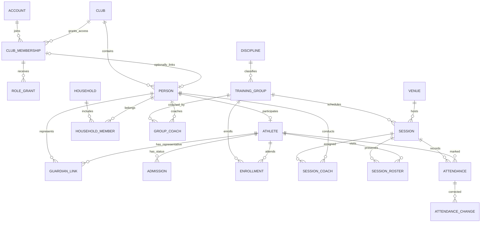
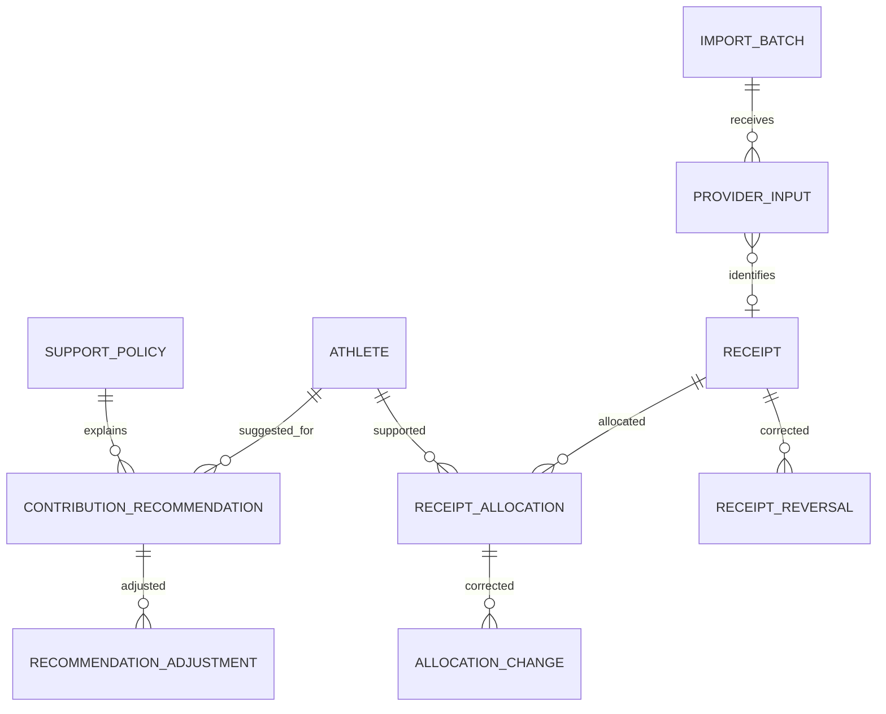

# Модель данных JudeOS / Judo Pride

Версия 0.4 · 7 октября 2026 года. Концептуальная модель к [архитектуре 0.4](ARCHITECTURE.md) и [плану MVP 1.1](MVP-DEVELOPMENT-PLAN.md), не готовый SQL или окончательный API. Это проектные рекомендации. Правила позднего приложенного плана используются как рабочий baseline; первоисточники D26–D63, включая поля D54 и отчёты D61, недоступны и не объявляются подтверждёнными.

Все клубные данные содержат tenant_id; Account/AuthSession относятся к платформенному входу и не хранят профилей детей. Профили разных клубов не объединяются автоматически. Сущность в схеме обозначает предметное понятие, а не требование создать отдельную таблицу уже в S0.

## Условия реальных данных (#18): согласование открыто

[Матрица данных/доступов и вариантов хранения](../docs/operations/real-data-conditions.md) отдельно охватывает профили, представительство/контакт, sick/Admission и их историю, staff/token metadata, аудит, логи, импорт/экспорт, Telegram, устройства и копии. Оператор в РБ, основания по классам, реальные сроки/права и пилот пока не подтверждены; [ADR 0012](adr/0012-real-data-pilot-conditions.md) — предложение. UUID/digest не объявляются обезличиванием; архивирование не является удалением, старые копии могут вернуть удалённые данные/отозванные права.

Access #21 реализован на schema4; Person/GuardianLink/Admission/журнал остаются planned, прототип имитирует сервер. #26/draft #102 с уточнениями полей/ролей ведёт коллега; его контракт не принят этой записью. Четыре synthetic статуса сохраняются: отсутствие решения о sick/допуске блокирует их реальное использование, не меняет API автоматически. Медицинские файлы/диагнозы исключены. Retention/cleanup jobs и production restore не реализованы; подтверждённые изменения будут оформлены в своих API/OpenAPI и новых миграциях, применённый SQL здесь не переписывается.

## Когда появляется хранение

| Срез | Необходимое хранение |
|---|---|
| S0: вход и основа | Club, Account/AuthSession, ClubMembership/RoleGrant, одноразовые приглашения/восстановление, минимальный аудит |
| S1: люди и онлайн-журнал | Person/Athlete, GuardianLink, семья, Admission, группы/связи/занятия/состав, Attendance/история, OperationResult, конкретный импорт исходного состава |
| S2: поддержка | Периоды и порядок детей в семье, версии правил/рекомендации, поступления/распределения/корректировки, строки конкретного платёжного импорта |
| S3: доставка | TelegramBinding/BindingToken, OutboxEvent, задания доставки; worker и долговременные jobs раньше — только если требуются конкретному импорту |
| S4: короткий офлайн | Серверный контекст снимка и recovery epoch, локальная очередь IndexedDB, совместимость версий команд |

Биллинг платформы, кабинеты участников, чаты, нормативы/рейтинги, универсальный каталог модулей и конструктор полей после MVP. Пустые таблицы и интерфейсы для них сейчас не создаются. Общие небольшие утилиты импорта не заменяют правила отдельных предметных модулей.

## Люди, доступ, группы и занятия

Диаграмма опускает часть служебных ссылок на клуб. ClubMembership означает доступ аккаунта к клубу, не юридическое членство и не участие в тренировках. Необязательная связь с Person проверяется внутри того же клуба; профиль существует без аккаунта. Будущая активация кабинета добавляет проверенную связь с существующим профилем, не создаёт второго спортсмена. Имя/телефон сами по себе не доказывают эту связь.

| Сущность | Существенные данные и ограничения |
|---|---|
| Club | Название, часовой пояс, состояние; Europe/Minsk для текущего клуба; секреты отдельно от публичного конфига |
| Account / AuthSession | Вход, безопасный хеш пароля; хеш секрета сессии, срок/отзыв; данные детей не входят в сессию |
| ClubMembership / RoleGrant | Аккаунт, клуб, состояние членства доступа; фиксированная роль и scope, период/отзыв. Три активные роли MVP: администратор, менеджер, тренер; parent/athlete пока не выдаются |
| Person / Athlete | Профиль клуба и спортивное участие; стабильные ID, состояние гостя/участника, архив; имя не уникально, аккаунт необязателен |
| GuardianLink | Представитель и конкретный Athlete, статус/основание проверки, период и разрешённые категории информации; отдельно от семьи |
| Household / HouseholdMember | Семья для условий поддержки, состав/период и порядок детей; не автоматическое разрешение просмотра |
| Admission | Допущен / не допущен / требует проверки, срок и автор/история; без диагнозов и файлов; не блокирует запись факта присутствия |
| Venue / Discipline / TrainingGroup | Зал, направление, группа; группа не содержит единственного group.coach_id |
| Enrollment / GroupCoach | Связи с периодом действия; несколько групп/тренеров, прошлые назначения сохраняются |
| ScheduleTemplate / Session | Простой недельный шаблон и конкретная дата; устойчивый ключ исходного слота, версия, состояния/перенос/отмена; перенос сохраняет Session ID и ключ генерации |
| SessionRoster / SessionCoach | Состав, признак trial/вид участия и тренеры конкретного занятия; перевод группы не переписывает историю |
| Attendance / AttendanceChange | Уникально клуб/занятие/спортсмен; один из четырёх статусов, версия, автор и время; до/после исправления, необязательная причина |

Точные поля карточки D54 не восстановлены. Минимальный состав определяется контрактом S1: ID, отображаемое имя, состояние участия, необходимые связи/контакт представителя. Контакт ребёнка не становится обязательным; дата рождения — отдельная дата при подтверждённой необходимости. Тренер читает только телефон выбранного основного представителя участника своего занятия; API, поиск и экспорт применяют те же ограничения полей. Прежнее назначение тренера не даёт бессрочного доступа к контактам.

Attendance использует `present`, `absent`, `sick`, `unmarked`: «Был», «Не был», «Болел», «Не отмечен». `trial` — отдельный признак участия. Закрытие предупреждает о неотмеченных и сохраняет `unmarked`; назначенный тренер может исправить закрытое занятие в разрешённой области. Автор, время и до/после обязательны; причина нет. Административное закрытие и доступ бывшего тренера требуют явного правила до реализации, без расширения полномочий по умолчанию.

Отмена занятия сохраняет уже сделанные отметки и требует разбора; отменённое занятие исключается из обычного знаменателя отчёта. Одновременные изменения состава/назначения/состояния Session проверяют версию. Attendance версионируется отдельно для каждого спортсмена.

## Гость и разбор дубля

Новый гость создаётся **только онлайн** как Person/Athlete без Account. Идемпотентная команда сохраняет гостя и его визит; запись поступает менеджеру. Превращение в постоянного участника сохраняет ID и посещения. Офлайн можно добавить только известного, заранее загруженного в разрешённом scope спортсмена: атомарная команда `add-known-and-mark` проверяет права, создаёт участие при отсутствии и сохраняет отметку с ожидаемой версией. Временных офлайн-профилей и графа зависимых команд нет.

Совпадение имени/телефона предлагает кандидат на дубль. Менеджер явно подтверждает связь с канонической карточкой; старый ID и происхождение сохраняются. Конфликтующие отметки одного занятия, финансовые связи и спорное представительство останавливают связывание до разбора. Логины и права представителей не объединяются автоматически. Исправление ошибочного связывания проверяет появившиеся зависимости; массовый универсальный merge/unmerge не входит в MVP.

## Поддержка и поступления

Рекомендация, поступление и распределение — независимые понятия. PROVIDER_INPUT может содержать повтор или изменённое состояние уже известной операции; число строк источника не равно числу поступлений. Распределение относится к ребёнку и месяцу поддержки, ссылка на рекомендацию необязательна. Неопределённое назначение остаётся нераспределённым; отсутствие добровольной поддержки не создаёт долг и не ограничивает занятия.

| Сущность | Существенные данные и ограничения |
|---|---|
| SupportPolicy | Версия месячных сумм и семейных условий с датой вступления; baseline 110/88/77/0 BYN для первого/второго/третьего/четвёртого и последующих детей, порядок задаёт менеджер |
| ContributionRecommendation | Athlete, локальный месяц, сумма в копейках BYN, версия правил и исходные условия; прошлое не пересчитывается из сегодняшнего состава семьи |
| RecommendationAdjustment | Автор, основание, точная сумма и период; уменьшает семейную сумму следующего месяца до минимума ноль; прошлый месяц изменяется явно с историей |
| ImportBatch / ProviderInput | Источник, parser version, пакет/source key, внешний ID, исходные поля, результат строки и ошибки; доступ/срок хранения сырья ограничены |
| Receipt | Подтверждённый источник, сумма/валюта, provider account, внешний ID в проверенной области уникальности, дата; сведения плательщика только при наличии |
| ReceiptAllocation | Часть суммы, Athlete и месяц поддержки; подтверждение и история; доступная сумма защищена блокировкой Receipt в одной транзакции |
| ReceiptReversal / AllocationChange | Связь с исходным поступлением/распределением, сумма, автор/основание, внешнее подтверждение при необходимости; компенсируют эффект, не стирают историю |

MVP работает с целыми копейками BYN без конверсий. При возврате распределённых денег нужные распределения компенсируются в той же транзакции. Чистые подтверждённые поступления = действующие распределения + нераспределённый остаток для одной согласованной выборки; рекомендации в равенство не входят. Дата поступления и месяц поддержки — разные измерения отчёта.

Уникальность Receipt: `(tenant, provider account, external operation ID)` только в подтверждённой договором области. Повтор ID с иной суммой/валютой/статусом — конфликт или изменение источника для разбора, не молчаливый пропуск. Без надёжного ID отпечаток строки лишь предлагает дубль; похожие настоящие платежи не схлопываются. Повтор того же пакета/строки предотвращается source key; повторы между разными реестрами без ID требуют сверки. [Предоставленная спецификация iPay](../docs/integrations/ipay/README.md) описывает on-line XML-вход, но не подтверждает подключение клуба или формат файла.

Для будущего on-line адаптера следует различать RequestId (N8, корреляция одной цепочки), TransactionId (N12, транзакция iPay), ServiceProvider_TrxId (S12, выдаваемый поставщиком ID) и PersonalAccount (S30, область услуги). TransactionResult не содержит суммы — нужен сохранённый TransactionStart с Amount/Currency; один результат не даёт полного Receipt. DateTime — время сообщения без указанной зоны, не подтверждённая дата банковского зачисления или месяц поддержки. Строки ФИО/адреса необязательны; поле периода поддержки отсутствует. Деньги преобразуются точно из внешнего F12,2 с запятой в целые копейки. Debt/Editable не утверждают долг или произвольную сумму клуба. Предложение хранить начало/вход/результат и атомарно компенсировать подтверждённое сторно — [ADR 0003, предложено](adr/0003-ipay-inbound-payment-protocol.md). Конкретные таблицы, ключи и миграции добавляются с согласованным адаптером, не этим разбором PDF.

## Технические данные по мере включения функций

- **OperationResult** (с S1): `(tenant, actor, operation_id)`, request hash, версия контракта, результат/ссылка на эффект и срок хранения. Тип, target, payload и base_version входят в хеш; бизнес-изменение, история и результат атомарны. Конкурентные повторы сериализуются уникальностью.
- **ImportBatch/строки** — уже долговременный вход файла. Отдельный InboundMessage нужен только для реально подключённого внешнего callback; не дублировать реестр в универсальном inbox.
- **OutboxEvent** (с S3): событие/версия в одной транзакции с исходной операцией после включения доставки; минимум персональных полей. Изменение Attendance не порождает уведомление MVP.
- **Job / NotificationDelivery**: tenant, событие/версия, канал/получатель, попытки, next_attempt_at, lease_until/token, состояние/результат. Уникальность события/версии/канала/получателя; сеть вне транзакции, завершение проверяет lease token. Задания иных типов добавляются только при реальной потребности.
- **TelegramBinding / BindingToken**: связь с Person и клубом, подтверждение/отзыв; одноразовый непрозрачный токен с хешем и сроком. Владение ссылкой не доказывает право на данные ребёнка; менеджер подтверждает получателя по уже проверенному контакту.
- **AuditEvent**: tenant, actor, действие, объект, время, разрешённые до/после; необязательная причина исправления посещаемости. Аудит имеет отдельные права и срок хранения.
- **Настройки и credentials**: несколько явных серверных переключателей, дата/версия активации типов доставки; секреты отдельно защищены. Платформа feature flags и ModuleEntitlement не требуются в MVP.

В Telegram только подтверждённое распределённое поступление и перенос/отмена. Перед отправкой проверяются актуальные GuardianLink, права на поля, roster, версия события и флаг доставки. Представитель одного ребёнка не получает данные остальных детей из общего платежа. Приём Telegram не доказывает прочтение; unknown финансового сообщения направляется на ручной разбор. Пауза хранит очередь, активация не рассылает историю автоматически.

## Офлайн и сроки идемпотентности — S4

Серверный context/snapshot ID описывает выданные аккаунту и клубу данные, время выдачи, область и recovery epoch. Его проверяемое представление выбирается контрактом S4; отдельная универсальная подсистема контекстов не нужна. Context/snapshot ID и recovery epoch входят в неизменяемый envelope и request hash. Снимок не выдаёт полномочий: текущая сессия, scope, состояние занятия и доступа проверяются перед применением и возвратом сохранённого результата.

В IndexedDB раздельно по аккаунту/клубу хранятся минимальный снимок, версии и свежесть, локальная отметка и очередь. Cache API содержит только публичную оболочку. Данные на сегодня определяются Europe/Minsk; вчерашний/истёкший снимок не допускает новых правок, но не удаляет ожидающую очередь. Контакты/допуск не кэшируются без явного перечня; статус «болел» учитывается в составе защищаемых данных. Платежи, права и создание человека офлайн недоступны.

На одну отметку — максимум одна неизменяемая отправленная команда (`in-flight`) и отдельно последнее ожидающее локальное значение (`pending`). До первой отправки нажатия сворачиваются; после неё ID и payload не меняются. После `applied` pending получает новый ID и base_version из ответа; потерянный ответ сначала повторяет исходную команду. При conflict/rejected цепочка останавливается до явного решения. Координация вкладок и сохранение отметки/команды атомарны в IndexedDB; память компонента этого не обеспечивает.

Окно новых офлайн-правок «сегодня» отдельно от срока доставки. Предложение для контракта S4: неизвестная команда применяется до 7 дней от серверного снимка; полный OperationResult хранится 30 дней. Это не подтверждённые бизнес-сроки. Известная операция возвращается при действующих правах и том же epoch без повторного эффекта. После очистки полного ответа остаются ключ/хеш/ссылка на эффект на срок учёта либо старый контекст гарантированно отклоняется. Истёкшая команда не получает новый ID автоматически и остаётся для разбора.

## Инварианты доступа, изменений и восстановления

1. Составные FK по tenant_id и ID исключают межклубные ссылки. RLS USING/WITH CHECK дополняет их; runtime не владелец таблиц, без BYPASSRLS, контекст локален транзакции. Объектные права и разрешённые поля проверяются отдельно от RLS.
2. Attendance уникальна по клубу/занятию/спортсмену, версия проверяется на каждую правку. Ни закрытие, ни недоставленная команда не превращают `unmarked` в `absent`.
3. Все пути распределения/возврата блокируют Receipt и соблюдают неотрицательный доступный остаток; деньги не удаляются ради отката.
4. Та же команда с тем же ID возвращает прежний результат после проверки текущих прав; иной hash отклоняется. Автор не берётся из произвольного payload.
5. Семья, платёж, Telegram chat_id и знание ID не выдают прав на ребёнка. Архивирование/отзыв прекращает доступ; последнего активного владельца нельзя лишить полномочий без передачи.
6. Перевод группы, изменение шаблона/правила поддержки и архивирование не переписывают прошлые факты. Исправления сохраняют происхождение и проверяют зависимости.
7. Worker, импорт, экспорт и синхронизация проверяют tenant и актуальные права; экспорт проверяется при формировании и выдаче, временный файл имеет срок жизни.
8. Отключение модуля не удаляет очередь. Схема меняется совместимыми expand/contract миграциями; разрушительная down-миграция не является штатным откатом.
9. После восстановления старой БД отправка и запись изолированы: восстановленные сессии/invite/reset/binding токены отзываются, RoleGrant/GuardianLink и запреты потерянного периода проверяются по независимому источнику или ответственным сотрудником. До проверки соответствующий доступ закрыт.
10. Новый recovery epoch запрещает обычный replay старой очереди даже при совпавшей версии. Платежи сверяются с источником; потенциально отправленные после точки восстановления сообщения карантинируются. Внешняя доставка возобновляется отдельно после сверки, не автоматически при старте worker.
11. История не означает бессрочное хранение персональных данных: сроки и обезличивание определяются по классам данных, включая исходные реестры, аудит, офлайн-копии и резервные копии.

## Расширения без таблиц-пустышек

ЛК связывает проверенный Account с существующим Person/GuardianLink. Чаты позднее получают собственные правила участников, истории, выхода и модерации; NotificationDelivery не становится сообщением чата. Для нормативов позднее нужны определения метрик, единицы/методики, измерения, версии стандартов и правил рейтинга; стабильный Athlete ID сохраняется сейчас. Пояса/разряды моделируются собственной историей присвоения/исправления, не универсальным полем «рейтинг» в Person.

Медицинские документы требуют отдельного решения по составу и хранению. Биллинг платформы добавляется после MVP с версией ставки, определённой базой расчёта и правилами возвратов. JSONB допустим для ограниченной конфигурации/исходного payload, не вместо связей основной модели. Ни одно из этих расширений не требует заранее создавать таблицы или инфраструктуру.

## Согласование с HTTP-контрактом

Для первого сценария подготовлены [словарь данных](../api/DATA-DICTIONARY.md), [OpenAPI](../api/openapi/openapi.yaml) и [открытые вопросы](../api/OPEN-QUESTIONS.md) по #16. Контракт принят по DECISIONS U2026-10-07-S0-01, [ADR 0006](adr/0006-first-online-contract.md); это не финальный API/SQL и не восстановленные поля D54. В предложении DTO roster разделяет Person ID и Athlete ID, отметку и trial; Account/семья/GuardianLink не подменяют Athlete или право доступа. Версия 0 представляет ещё не записанный unmarked, явное сохранение создаёт версию 1; дальнейшие команды увеличивают независимую версию спортсмена. OperationResult сохраняет успешный ответ или терминальный конфликт версии атомарно с проверкой/эффектом; актуальные права и отмена/архив проверяются перед replay. Сроки хранения ID/результатов и recovery остаются открытыми до #18/#52. Хранение/миграции появляются с #20/#29/#31, а не в контрактной задаче.

Backend использует Go + net/http + chi v5 ([ADR 0004](adr/0004-chi-and-api-documentation.md)). Изменения описанных здесь данных, сценариев, прав и эксплуатационного поведения отражаются в соответствующих endpoint’ах OpenAPI и реестре в том же PR. Служебные и интеграционные маршруты также учитываются; Swagger UI отображает машиночитаемый контракт. Единые требования и проверки — [правила API](../docs/API-DOCUMENTATION.md).

## Реализуемая SQL-основа #20

[ADR 0008, предложено для ревью](adr/0008-tenant-isolation-and-audit.md) и миграция 00003: `core.clubs` (tenant_id — ID самого клуба, name, timezone); `development.sample_objects` (tenant_id, id, parent_id, label) — исключительно синтетическая иерархия для проверки составного FK `(tenant_id,parent_id)`; `core.audit_events` — tenant, identity event_id, actor UUID, серверный request_id, действие/тип/ID объекта, время. Составной PK объектов/аудита включает tenant; ссылки на Club обязательны. Прежние строки development.sample_clubs перенесены в Club и сохранены в старой таблице для upgrade; runtime к старой таблице не допущен. Account/RoleGrant/Person/Athlete/журнал здесь ещё не создаются.

На трёх таблицах ENABLE/FORCE RLS, USING/WITH CHECK; runtime не владелец и не может DDL/TRUNCATE. Tenant/actor/request локальны одной транзакции, приложение проверяет наличие до любого SQL. Триггер изменений записывает только разрешённую метаинформацию, без контактов/имён/label/произвольного before/after; результат и аудит атомарны. Неизменившийся UPDATE и повтор seed не добавляют событие. Прошлые события при переносе старых fixtures не выдумываются. AuditEvent этой основы пока не предметная история AttendanceChange.

Runtime не читает и не меняет AuditEvent; отдельная NOLOGIN capability judeos_audit_reader читает только выбранный tenant, продуктовые права ей не назначены. В синтетическом контуре хранение ограничено жизненным циклом disposable БД/тома: удаление вместе с явным сбросом, без TTL/числового срока. Подтверждение реальных сроков, оснований, продуктовых прав, копий/удаления — #18/#24; до него реальные данные заблокированы. Проверки двух клубов и upgrade/пула/аудита: `make check-db`.

## Реализованный доступ #21 (schema 4)

Миграция 00004: global `access.accounts` (normalized login, optional Argon2id hash, disabled), `access.sessions` (SHA-256 bearer, account, absolute TTL, revoked, synchronizer CSRF), `access.preauth` и shared hash-keyed `access.rate_limits`. Tenant `core.memberships` (composite tenant/id, account, active), `core.role_grants` (fixed role/scope), `core.access_tokens` (composite tenant/id/membership, kind, hash, expiry, used): FORCE RLS, composite FK, explicit column/table privileges. Person/Athlete здесь не создаются. SQL last-owner trigger и club transaction lock защищают active administrator; metadata-only audit включает membership/role_grant/access_token. Discovery functions переходят от global authentication к tenant context; runtime не читает tenant rows без контекста. [Правила/TTL/bootstrap/ограничения](../docs/access/README.md), [ADR 0010, proposed](adr/0010-staff-access.md). Совпадение готового login не разрешает связывать клубы или менять чужой пароль.
