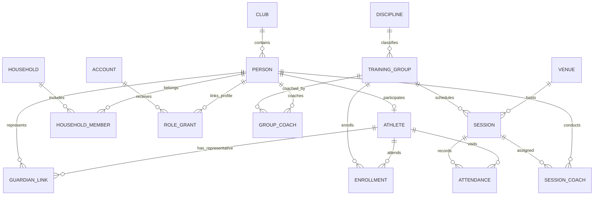
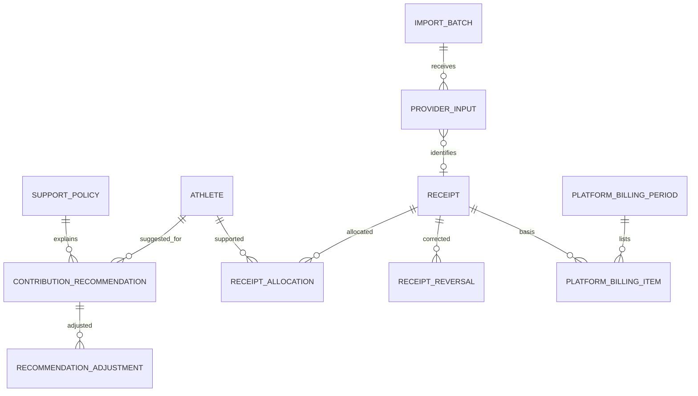

# Модель данных Judo Pride

7 октября 2026 года. Концептуальная модель для версии архитектуры 0.3; это не готовый SQL и не окончательный API. Все сущности клуба имеют tenant_id. Профили детей не объединяются автоматически между клубами.

## Люди, группы и занятия

Диаграмма опускает часть служебных ссылок на клуб. ACCOUNT относится к платформенному уровню аутентификации; ROLE_GRANT связывает разрешённый аккаунт с профилем, ролью и областью внутри клуба. Профиль ребёнка может существовать без аккаунта. При выдаче будущего детского входа добавляется проверенная связь аккаунта с профилем, а не новый спортсмен.

| Сущность | Существенные данные и ограничения |
|---|---|
| Club | Бренд, часовой пояс, состояние подключения; не хранить секреты в публичном конфиге |
| Account / AuthSession | Вход и отзываемая сессия; хеш секрета сессии, срок, отзыв; без данных ребёнка в сессии |
| Person / Athlete | Профиль клуба и участие; стабильный ID, состояние, архивирование; имя не уникально |
| GuardianLink | Представитель/ребёнок, подтверждение и область разрешённых действий; действует независимо от семьи |
| Household / HouseholdMember | Семья для условий поддержки, состав/период; не автоматическое разрешение просмотра |
| RoleGrant / Scope | Аккаунт/профиль, действие через роль и область; назначение с периодом/отзывом |
| Venue / Discipline / TrainingGroup | Зал, направление, группа; тренеры не единственным полем group.coach_id |
| Enrollment / GroupCoach | Несколько связей с периодом действия; прошлые назначения не заменяются новым ID |
| ScheduleTemplate / Session | Правило и конкретная дата; уникальный ключ генерации; перенос/отмена; Europe/Minsk для текущего клуба |
| SessionRoster / SessionCoach | Состав и тренеры конкретного занятия; сохранённая история при переводе |
| Attendance / AttendanceChange | Уникально клуб/занятие/спортсмен; статус, версия; предыдущая запись, автор и причина изменения |

Офлайн-гость получает временный UUID операции/профиля. Создание временной записи и отметки связано одной идемпотентной командой; сервер проверяет возможный дубль и не создаёт молча второго ребёнка. Необходимые поля и политика допуска гостя уточняются. Менеджерское объединение подтверждённого дубля сохраняет аудит и переназначает связи без потери посещений. Автоматическое объединение по имени запрещено.

## Поддержка и поступления

PROVIDER_INPUT может относиться к повторному состоянию уже известной операции; множество входных записей не равно множеству поступлений. RECEIPT_ALLOCATION относится к ребёнку и периоду поддержки, а связь с рекомендацией может быть необязательной. Не определённое назначение остаётся нераспределённым, не становится выдуманным долгом.

| Сущность | Существенные данные и ограничения |
|---|---|
| SupportPolicy | Версия суммы/семейных условий с датами; точное округление определяется правилами |
| ContributionRecommendation | Ребёнок, период, сумма в копейках, версия правил; добровольное предложение |
| RecommendationAdjustment | Автор, основание, значение/тип и дата; не перезаписывать причину прошлой корректировки |
| ImportBatch / ProviderInput | Источник, исходный внешний ID, время, статус строки и ошибки; ограниченный доступ/срок хранения сырья |
| Receipt | Подтверждённое поступление, сумма/валюта, поставщик, внешняя операция, дата и источник подтверждения |
| ReceiptAllocation | Сумма, ребёнок, период, подтверждение; доступная сумма контролируется транзакцией Receipt |
| ReceiptReversal / AllocationChange | Возврат/исправление со связью на исходную операцию; аудируемое состояние |
| PlatformTariff / BillingPeriod / BillingItem | Версия ставки/фиксированной платы, база операций, период; объяснимый повторный расчёт |

## Технические сущности

- InboundMessage / OperationResult: долговременный вход или идемпотентный результат команды, request hash и срок хранения.
- OutboxEvent: событие и версия, созданные вместе с предметной операцией; минимум персональных полей.
- Job / NotificationDelivery: клуб, получатель, версия события/шаблона, attempts, next_attempt_at, lease_until, состояние и результат внешнего сервиса.
- TelegramBinding / BindingToken: подтверждённый получатель и одноразовая привязка с истечением/отзывом; токены не хранить открытым текстом.
- AuditEvent: actor, действие, объект, основание и разрешённый состав изменений; доступ и хранение отдельно от общего лога.
- ClubConfig / ModuleEntitlement / IntegrationCredential: настройки, включённые возможности и отдельно защищённые секреты.

## Инварианты базы и операций

1. Составные FK по tenant_id и ID не дают связать данные разных клубов.
2. Attendance уникальна на занятие/спортсмена; версия проверяется при изменении.
3. Receipt уникальна по подтверждённой области внешнего идентификатора поставщика; при отсутствии ID дедупликация требует отдельного решения.
4. Деньги — целые копейки и валюта; сумма допустимых распределений проверяется с возвратами внутри транзакции.
5. Подтверждённое финансовое изменение и outbox атомарны; повтор команды не повторяет эффект.
6. При повторе operation_id с изменённым содержимым — ошибка, а не молчаливый успех.
7. Перевод группы, отзыв права и смена тарифа не переписывают старые события/составы.
8. Семья, контакт Telegram, имя и знание ID не являются самостоятельными основаниями доступа к ребёнку.
9. Служебная очередь тоже проверяет клуб; worker выполняет задачи в явно установленном tenant-контексте.
10. Сроки хранения и процедуры обезличивания задаются по классам данных; история не означает бессрочное хранение всех персональных подробностей.

## Расширения

SportsMetricDefinition, Measurement, StandardVersion и RankingRule добавляются позже, с единицами/методиками/возрастными условиями и историей исправлений. Медицинские документы — отдельные данные с ограниченным доступом и согласованным хранилищем; документы не помещаются в универсальный JSONB profiles.extra ради ускорения запуска. JSONB допустим для ограниченных конфигураций и исходных внешних payload, но не вместо связей и ограничений основной модели.
