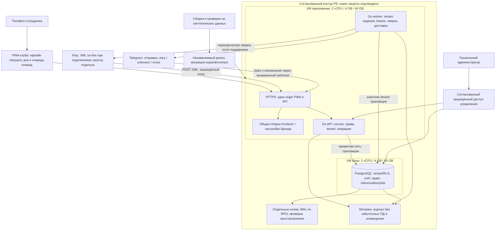
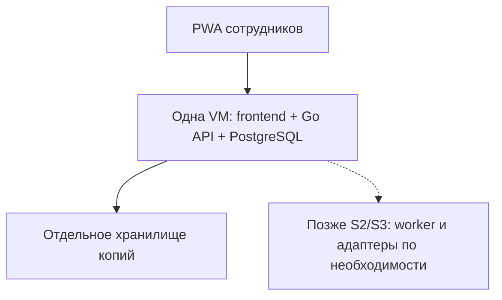

# Инфраструктура Judo Pride

Версия 0.4 от 7 октября 2026 года, согласована с [архитектурой](ARCHITECTURE.md) и [планом MVP](MVP-DEVELOPMENT-PLAN.md). Одна VM допустима для узкого пилота; две VM — вариант разделения нагрузки, не обязательное условие и не failover. PostgreSQL-очередь и worker подключаются с соответствующими функциями S2/S3; общие релизы сохраняются. Протокол iPay описан в предоставленном PDF; режим подключения клуба, контур защиты и хостинг открыты. Ресурсный расчёт и сведения о прежней проверке тарифов сохранены из документа 0.3; при текущей интеграции цены повторно не проверялись. Acronis остаётся примером по проверке 6 октября, совместимость услуги не подтверждена.

## S0: синтетический CI/test по #22

[Инструкция эксплуатации](../docs/operations/README.md) описывает самостоятельный test-контур и [ADR 0009, предложено](adr/0009-ci-test-releases.md). CI проверяет Go/web/контракт, реальные PostgreSQL-миграции, воспроизводимость образа и локальный HTTPS; это не проверка публичного размещения. Test API и DB не имеют published ports; DB только в internal Docker network. Edge Caddy использует local CA для проверки либо public ACME после выбора настоящего DNS/host. Config/DB credential/API secrets находятся раздельно вне checkout; test не использует production secrets/данные.

Release manifest определяет source commit, image ID/registry digest, schema и migration hashes. Предыдущий совместимый образ требует проверки readiness, не выбирается автоматически по предыдущему tag. Protection main настраивает администратор после появления checks: Go, Web and contract, Migrations, Image and HTTPS, PR/ревью и запрет force-push. Настройка не объявляется выполненной по одному workflow.

8 октября после ручного merge #95/#96 опубликован [synthetic prerelease v0.1.0-test.2](../docs/operations/second-synthetic-release.md) из accepted main0c22445: все пять tag CI jobs/Publish, manifest/tag gate и anonymous GHCR pull/full checker на Docker29.8.2/containerd и Docker28/classic успешны. Оператор повторил gate/pull/full checker на VPS, подтвердил enable, #91 выполнила **один** первый Apply37764403714 success. Исторический workflow failure из-за первоначальной AAAA сохраняется; после её удаления independent public37765696629/final37766878813 success: trusted TLS/redirect/root/health/readiness/OpenAPI/docs, TCP80/443 open,5432/8080 closed. #98/#100 merged, актуальная main8b88035/CI37771769942 success; frozen runtime/source0c22445/manifest/config/volumes и release1 сохраняются. Новое release/deploy/bootstrap/reboot без согласования оператора не выполняется. [Build/publish требуют classic image store](../docs/operations/releases.md#docker-image-stores-config-digest-и-manifest-digest), containerd guard fail-closed; будущая адаптация CI отдельная.

Hostinger VPS `187.7.69.230` (Ubuntu 24.04 LTS, 1 CPU / 4 GB / 50 GB), `judopride.tech`, оператор NikishGum. [Эксплуатационная приёмка](../docs/operations/hostinger-operations.md) сверяет критерии #22 и содержит read-only VPS disk/HTTP, согласуемые backup/restore под существующим deploy lock и отдельный reboot-check без смены baseline. CI synthetic dump/restore/readiness outage-recovery проходит; [VPS backup/isolated restore success](https://github.com/StarMadeGalaxy/JudeOS/issues/22#issuecomment-6059425070), dump0600/17381 bytes, schema/fixture/clubs/objects/audit counts совпали, pre/post HTTPS/DB isolation pass; пользователь подтвердил read-only disk/HTTPS/Docker, а разрешённый cloud runtime exercise release1 на текущей schema3/fixtures release2 завершился success (HTTP contract/readiness/DB signature). Previous=null в immutable manifests сохраняется, проверенный кандидат записан в #22. Reboot не разрешён/не выполнен, необязательная отдельная проверка, не новый checkbox исходных критериев. Main protection применена пользователем (явное «Сделал»), branch API protected=true/четыре contexts/Actions app15368/enforcement everyone; остальные параметры подтверждены пользователем, детальный API403, rulesets[]. [Требования/payload](../docs/operations/releases.md#защита-main-после-появления-checks) и CONTRIBUTING актуализированы. Off-host storage/scheduler/пороги/RPO/RTO/retention/alerts и будущий ACME renewal не подтверждены и не выдумываются. Standalone test переиспользует принятую #20/схему3/раздельные credentials; shared files не меняются. Production/реальный пилот остаются за #18/#24. Фактические критерии #22 подтверждены; остаются ручная приёмка/merge завершающего PR97 с Closes #22 и Project → Done, без новых VPS команд.

## Вариант полного MVP после S3/S4

Здесь API, frontend и worker могут размещаться на одном сервере. База на втором сервере доступна только по приватной сети. iPay и Telegram показаны как внешние интеграции; их доступы и передаваемые поля нужно включить в проект защиты. Деньги родителей поступают непосредственно клубу; эта схема показывает обмен данными, а не транзит денег через платформу. Личные устройства и локальные копии PWA анализируются отдельно. Подтверждённая потребность в данных о здоровье требует пересмотра состава защиты по этапам до оценки полного бюджета.

[PDF iPay](../docs/integrations/ipay/README.md) описывает POST-параметр XML и windows-1251, заголовок ServiceProvider-Signature и рекомендуемый VPN. Это входящий endpoint поставщика; алгоритм подписи, Content-Type, адреса/IP, test/production и подключение клуба не установлены. Для подключённого режима предложены HTTPS, ограничения XML/тела запроса, проверка согласованной подписи и сохранение до ответа ([ADR 0003, предложено](adr/0003-ipay-inbound-payment-protocol.md)). HTTP 200 не подтверждает оплату. Периодическая сверка в схеме условна: API истории/реестр/банковское зачисление этим PDF не описаны. Способ файлового импорта и защита реального контура всё ещё требуют отдельного подтверждения.

## Компактный пилот S1 и постепенное включение

Одна VM — единая точка отказа: при сбое прекращаются и API, и работа с базой. Она подходит для ограниченного пилота при принятом времени восстановления. Требования к персональным данным сохраняются и в пилоте с реальными данными.

## Стартовые ресурсы

| Вариант | Сервер приложения | Сервер базы | Ограничения |
|---|---|---|---|
| Пилот | Одна общая VM: 2 vCPU, 4 GB RAM, 80 GB быстрого диска | На той же VM | Нет автоматического failover; внешние копии обязательны, требуется замер нагрузки |
| Рабочий MVP | 2 vCPU, 4 GB RAM, 40 GB | 2 vCPU, 4 GB RAM, 80 GB быстрого диска | Разделение нагрузки, но по одному экземпляру каждой службы |

Ресурсы — инженерная начальная оценка для учёта без тяжёлого видео, предполагающая десятки активных сотрудников. 1000 участников клуба не означает 1000 одновременных подключений. Подтверждены четыре зала; число сотрудников и пики неизвестны. Перед запуском проверить реальные списки, отчёты, импорт и пики работы. Объём копий 100 GB в расчёте ниже — бюджетное допущение, уточняется после политики хранения и замеров. Будущие документы и спортивные измерения требуют отдельного замера; их полный объём в исходный расчёт не включён.

## Проверяемый пример стоимости

Источник прежнего расчёта: [прейскурант ActiveCloud](https://www.activecloud.by/clients/prices/), раздел 11 E-Cloud Protected; в документе 0.3 указана проверка 7 октября 2026 года. Это сохранённый пример, не обновлённая коммерческая смета. Провайдер приведён как пример расчёта; выбор не сделан. Цена ресурсов не подтверждает достаточность полного набора защиты.

В опубликованном тарифе без НДС: vCPU 21,45 BYN/ядро/месяц, RAM 28,76 BYN/GB/месяц, диск A 0,89 BYN/GB/месяц. В расчёте налог для сравнения принят 20%; применимость и итоговую смету подтверждает провайдер.

| Компонент | Без НДС, BYN/мес. | При допущении НДС 20%, BYN/мес. |
|---|---:|---:|
| Общая VM пилота 2/4/80 | 229,14 | 274,97 |
| VM приложения 2/4/40 | 193,54 | 232,25 |
| VM базы 2/4/80 | 229,14 | 274,97 |
| Две VM рабочего MVP, вместе | 422,68 | 507,22 |
| Пример сетевой части: Compact gateway + 1 внешний IP | 45,80 | 54,96 |
| Антивирусная защита: 1 VM / 2 VM | 7,68 / 15,36 | 9,22 / 18,43 |
| Пример 100 GB Acronis storage по разделу 15 | 42,00 | 50,40 |

Совместимость услуги копирования с выбранным защищённым контуром, расположение хранилища, дисковый класс, обязательные лицензии и минимальный заказ требуют подтверждения.

Плановый ежемесячный резерв: **450–700 BYN для пилота**; **750–1100 BYN для двух VM рабочего MVP**. Это наша оценка с запасом на сетевую часть, копии и ограниченное обслуживание. Эти диапазоны не являются предложением провайдера и могут вырасти после выбора средств защиты и режима поддержки.

Отдельные статьи: проектирование/аттестация СЗИ и документы, защищённый доступ управления, сопровождение приложения, SMS/email, комиссии платежей, миграция, тестовое окружение, файловое хранилище. Разовая аттестация не оценена без границ системы и коммерческого предложения. Для разработки на синтетических данных можно использовать обычное окружение; его стоимость не выдаётся за цену эксплуатации с ПД.

## Рост

Предлагаемый путь: замер CPU/RAM/IO и задержек → увеличение ресурсов → второй API/worker при необходимости → отдельная реплика базы/резервирование по согласованному SLA → разделение размещения клубов при росте или разных юрисдикциях. Копии и реплика решают разные задачи; необходимость отказоустойчивости определяется RPO/RTO.

Новые клубы должны использовать одно обновляемое ядро. Изоляция данных проектируется до их подключения; выделенная установка должна использовать тот же релиз с настройками, если такая модель продажи будет выбрана.

## Очередь, копии и релизы

С S0/S1 PostgreSQL хранит предметные записи, сессии, аудит и результаты команд. Хранение конкретного импорта состава появляется в S1, платёжного импорта — в S2, outbox/delivery — с активацией Telegram S3. PostgreSQL также обслуживает необходимые фоновые jobs, без отдельного брокера. Worker работает ограниченными пакетами по клубам; сетевой вызов не удерживает транзакцию. Долгий импорт/выгрузка не выполняется синхронно в запросе телефона. Секреты поставщиков доступны только нужному процессу. Для внешних webhook предусмотрены проверка подлинности и сохранение входа до обработки; методы проверки зависят от документации поставщика.

RPO/RTO выбираются до первого реального пилота; ранее предложенные 15 минут / 4 часа не являются гарантией или обязательным SLA. Для проверки нужны WAL-архив, базовые копии, конфигурация и ключи восстановления, контроль возраста архива и измеренное восстановление. [Документация PostgreSQL](https://www.postgresql.org/docs/current/continuous-archiving.html). Резерв 100 GB и исходный пример Acronis не доказывают выполнение этой цели; окончательный объём/стоимость уточняются. Поддержка 24/7, отказоустойчивость и работы по защите не следует считать включёнными в ресурсный расчёт.

Общая база требует защищённого хранения копий всех клиентов. Восстановление одного клуба выполняется из копии во временном изолированном контуре с переносом только его данных и проверкой ссылок/итогов; весь production нельзя откатить ради одного клиента. До второго клуба проверить эту процедуру и договорные условия восстановления.

Рост допускается по измерениям: сначала устранение медленных запросов и ограничение тяжёлых jobs, затем увеличение ресурсов, далее несколько API/worker. PostgreSQL-реплика/failover требует отдельной схемы и теста. Выделенное размещение для клиента включается тем же релизом без собственной ветки. Медиа/файлы, SLA, особые требования защиты или устойчивое влияние одного клиента на других являются основаниями пересмотра конфигурации; произвольное число пользователей таким основанием не служит.

## Отключение функций и восстановление

Для Telegram, импорта и новых офлайн-операций достаточно серверной конфигурации. При паузе сохраняются история, входные строки и накопленные задания; включение не запускает устаревшую рассылку. Отключение офлайн сохраняет endpoint/экран разбора поддерживаемой очереди. Релизы используют expand/contract; rollback приложения не удаляет новые финансовые записи.

Restore начинается в изолированной среде с запретом исходящих отправок и автоматических применений **в конфигурации запуска вне восстановленной БД**. Боевые отправляющие ключи в тестовом восстановлении не используются. Отзываются восстановленные сессии и одноразовые invite/reset/Telegram-binding токены; RoleGrant/GuardianLink потерянного периода проверяются по независимому журналу или вручную. До проверки доступ закрыт.

Новый recovery epoch запрещает автоматическое применение старых офлайн-команд к откатившейся истории. Внешние поступления повторно сверяются по достоверным ID; неизвестные совпадения разбираются вручную. Сообщение могло уйти после точки восстановления: такие jobs карантинируются, а не получают безусловный retry. После сверки итогов отдельно разрешаются запись и внешняя доставка.

До S1 проверить restore минимального журнала; до S3/S4 дополнить сценарием с уже отправленным сообщением, отозванным доступом и ожидающей командой. Время восстановления включает сверку, а не только запуск PostgreSQL. Полный runbook — архитектура §10.

## Согласование с HTTP-контрактом

Backend использует Go + net/http + chi v5 ([ADR 0004](adr/0004-chi-and-api-documentation.md)). Изменения описанных здесь данных, сценариев, прав и эксплуатационного поведения отражаются в соответствующих endpoint’ах OpenAPI и реестре в том же PR. Служебные и интеграционные маршруты также учитываются; Swagger UI отображает машиночитаемый контракт. Единые требования и проверки — [правила API](../docs/API-DOCUMENTATION.md).
