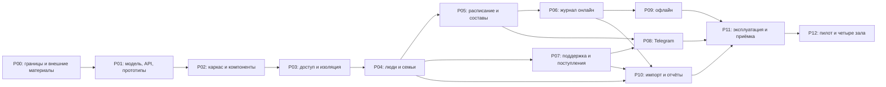

# План разработки MVP JudeOS / Judo Pride

Версия 1.0, 7 октября 2026 года. Статус: документ для разработки по результатам пяти раундов вопросов и двух заключительных уточнений. Приложение не реализовано; задачи ниже не созданы в GitHub. Календарные сроки не устанавливаются.

## 1. Цель, источники и границы

MVP заменяет основные рабочие таблицы клуба: сотрудники ведут людей и семьи, расписание, составы, посещаемость, рекомендуемую добровольную поддержку, фактические поступления и их распределение. Родители получают два вида Telegram-сообщений. Выпуск проходит пилот одного зала, затем используется во всех четырёх залах Judo Pride. Второй самостоятельный клуб подключается после MVP, но техническая изоляция проверяется уже в каркасе на втором синтетическом клубе.

Источники: [подтверждённые решения](DECISIONS.md), [раунды уточнения](MVP-INTERVIEW.md), [ADR 0001](adr/0001-mvp-technical-baseline.md), [архитектура 0.3](ARCHITECTURE.md), [критический разбор](ARCHITECTURE-REVIEW.md), [модель данных](DATA-MODEL.md), [инфраструктура](INFRASTRUCTURE.md), [сценарии](APP-FLOWS.md), [следующие шаги](NEXT-STEPS.md), [исследование](RESEARCH.md), [CONTRIBUTING.md](../CONTRIBUTING.md). Уточнения D26–D63 имеют приоритет над прежними предложениями. DOCX служит источником идей; ограничения прежнего описания не копируются автоматически.

В MVP входят три рабочих кабинета: администратор/владелец, менеджер, тренер. В модели пять стандартных ролей, включая будущие роли родителя и участника; один аккаунт может совмещать роли. Отдельные аккаунты родителей/детей не нужны для хранения их профилей, семей и Telegram-привязок. Матрица полномочий фиксированная, конструктор ролей отложен.

Не входят: кабинеты родителей и участников, CRM-доска заявок, мерч, турниры/сетки, внутренние чаты, спортивные измерения/нормативы/рейтинги, медицинские документы и диагнозы, создание нового гостя офлайн, обязательная MFA, push/email/SMS, расчёт процента и фиксированной платы платформе, продажи и самостоятельное подключение других клубов. Личные платёжные номера и API iPay зависят от договора, а не являются обещанными возможностями MVP.

## 2. Принятая техническая основа

| Раздел | Основа и обязательный результат |
|---|---|
| Frontend | React / TypeScript / Vite, mobile-first PWA; существующие токены и компоненты Judo Pride |
| Backend | Модульный Go backend, режимы API и worker; предметные модули access, people, training, attendance, contributions, notifications |
| База | PostgreSQL, tenant_id, RLS, составные FK, отдельные роли runtime/миграций/копирования |
| Контракт | REST /api/v1 и OpenAPI; единые ошибки, пагинация, версии и идемпотентные команды |
| Доступ | Серверные отзываемые сессии, защищённая cookie, проверка Origin/CSRF; приглашения/восстановление передаются вручную |
| Фоновые операции | PostgreSQL inbox/outbox/jobs; короткие tenant-транзакции, leases, retries и ручной разбор |
| Интеграции | Адаптер реестра iPay по реальному формату; Telegram через проверенную привязку и доставку из worker |
| Офлайн | Отдельная очередь команд в IndexedDB; короткий период расписания/составов; синхронизация с applied/conflict/rejected |
| Запуск | Контейнеры; один origin PWA/API; синтетические development/test данные, отдельное тестовое окружение |

TanStack Query, Dexie, pgx/sqlc и Compose — предлагаемые инструменты из архитектуры. Их совместимые версии проверяются и закрепляются в P02; замена значимого технического выбора оформляется ADR. Библиотека кэша запросов не заменяет долговременную очередь команд. Redis, отдельный брокер, Kubernetes и микросервисы для данного объёма не нужны.

Предлагаемая структура реализации: apps/web, cmd/api, cmd/worker, internal/<модуль>, internal/platform, db/migrations, api/openapi, ops. Это будущие каталоги, а не уже созданный код. Модули владеют правилами и таблицами; межмодульные операции используют application services и явные транзакции.

## 3. Дизайн-система и интерфейс

До проектирования каждого экрана читать [DESIGN.md](../DESIGN.md), [SOURCES.md](../design-system/SOURCES.md), сверять [tokens.css](../design-system/tokens.css), визуальную памятку [overview.png](../design-system/overview.png) и при необходимости [.impeccable/design.json](../.impeccable/design.json). Экранные задачи P04–P10 используют библиотеку компонентов P02.3; новые стили не обходят токены.

- Сохранять Rubik с кириллицей, основной текст 16 px на телефоне, красный --jp-primary, светлые поверхности и установленную шкалу радиусов/отступов. Шрифт подключать явно; CSS-токены сами его не загружают.
- Развить примитивы кнопки, поля, карточки, метки, диалога, списка, фильтра и состояния загрузки/ошибки. Менеджерские таблицы на телефоне адаптировать в списки/карточки; основные операции без горизонтальной прокрутки.
- Четыре отметки посещаемости различать текстом и доступным состоянием, а не только цветом. Красный одновременно фирменный цвет: ошибка требует текста/значка. «Не отмечен» не выглядит как подтверждённое отсутствие.
- Предусмотреть пустые данные, отказ доступа, ошибки формы, недоступную сеть, конфликт, сохранено локально/на сервере, очередь и последнее обновление. Технические operation_id/tenant_id не показывать в обычном пользовательском потоке.
- Проверять клавиатуру, видимый focus, управление фокусом диалогов, контраст текста, удобство нажатия, увеличенный текст и reduced-motion. Практику отключения outline из референсов не переносить.
- Фирменную систему адаптировать к рабочему журналу; маркетинговые карусели, фотографии и композиция главной не обязательны для кабинетов. Предложения по новым компонентам описывать отдельно; менять DESIGN.md и tokens.css согласованно.

Обязательные прототипы P01: вход/приглашение; контекст ролей; спортсмен/семья/допуск; расписание и состав менеджера; «мои занятия → отметки → закрытие → исправление»; добавление известного спортсмена/гостя; финансовая сверка/распределение; Telegram-привязка; импорт и отчёты; очередь/конфликт офлайн. Финальный просмотр — на рабочих телефонах iOS/Android и desktop менеджера.

## 4. Рабочие правила и права

| Действие | Администратор / владелец | Менеджер | Тренер |
|---|---|---|---|
| Сотрудники, приглашения, роли, отзыв доступа | Управляет | Не управляет сотрудниками/ролями | Свой вход и профиль |
| Спортсмены, представители, семьи | Весь клуб | Создаёт/редактирует, весь клуб | Данные своего занятия и ограниченный поиск для добавления |
| Залы, группы, тренеры, расписание | Весь клуб | Весь клуб | Просмотр назначенных занятий |
| Формирование состава занятия | Административный доступ; матрицу уточнить в P01 | Формирует состав | Только добавляет людей на своё занятие; не управляет группами и не исключает из состава |
| Отметки и исправления | Весь клуб | Весь клуб | Назначенное занятие, в том числе после закрытия |
| Закрытие занятия | Право административного исправления уточнить в P01 | Право служебного закрытия уточнить в P01 | Закрывает своё занятие |
| Перенос / отмена | Весь клуб | Весь клуб | Не разрешено |
| Допуск | Административный доступ | Изменяет | Видит результат; недопуск не блокирует присутствие |
| Контакты | Весь клуб в пределах полномочий | Весь клуб в пределах полномочий | Телефон выбранного основного представителя участника своего занятия |
| Поддержка, поступления, распределение | Весь клуб | Весь клуб | Не доступны через роль тренера |
| Отчёты / экспорт | Весь клуб | Весь клуб, финансы включены | Посещаемость в своей области; финансовый экспорт недоступен |

Это основа спецификации, а не готовая ACL. В P01 каждому действию назначаются permission, область и негативный пример; новые неоговорённые права отмечаются предложением. Совмещение ролей объединяет разрешённые действия, но выбор режима меню не является авторизацией. Ни скрытая кнопка, ни клиентский tenant-параметр не заменяют проверку API, worker, импорта и экспорта.

Основные предметные правила:

- Четыре зала, несколько направлений, несколько тренеров группы/занятия и участие спортсмена в нескольких группах. Формальное членство отдельно от участия; одинаковое имя не уникальный ключ.
- Менеджер собирает состав на конкретное занятие; тренер добавляет известного спортсмена либо нового гостя онлайн. Гость не создаёт аккаунт автоматически и поступает на разбор менеджеру. История состава сохраняется при переводах.
- «Был», «Не был», «Болел», «Не отмечен»; пробное посещение — признак. Закрытие не заполняет отсутствия. После закрытия отметки исправляются с автором, временем и прежним/новым значением, без обязательной причины.
- Минимальный допуск: допущен / не допущен / требует проверки, срок и автор изменения. Нет диагнозов/файлов. Статус «болел» и допуск включаются в анализ защиты данных до реального запуска.
- Поддержка добровольная: 110 / 88 / 77 / 0 BYN для первого / второго / третьего / четвёртого и последующих детей. Порядок задаёт менеджер. Отсутствие поддержки не становится долгом и не влияет на допуск.
- Изменения семейных правил действуют с выбранного месяца. Корректировка точной суммой применяется к уменьшенной сумме следующего месяца; итог не отрицателен. Прошлый месяц меняется явно с историей. Денежные значения — целые копейки BYN, без float.
- Подтверждённое поступление отдельно от рекомендации. Распределение по детям/месяцам, остаток нераспределённым, возвраты/исправления с историей; нельзя распределить больше доступной суммы. Спорные совпадения решает менеджер.
- Telegram: подтверждённое и распределённое поступление, перенос/отмена. Получатели — проверенные представители с правом на эти сообщения; семья и chat_id сами по себе не дают доступ.
- Архивирование сохраняет прошлый учёт и отзывает доступ сотрудника; политика хранения/удаления не означает бессрочное хранение персональных данных.

## 5. Порядок выполнения и зависимости

Технические работы идут по этапам P00–P12. Внутри этапа задачи выполняются по номеру, если явно не указан независимый ход. Каждый этап имеет входные зависимости и результат приёмки; зависимую реализацию нельзя начинать по неутверждённому API/модели.

Указанные ветви означают независимые потоки задач после фиксации контрактов, а не поручение запускать дополнительных агентов. Серверы, защита, образцы таблиц и iPay готовятся командой уже с P00; отсутствие образца не мешает синтетическому каркасу, но блокирует приёмку соответствующего реального импорта. Настройка тестового размещения P11 может начаться после P02; итоговая приёмка P11 требует P08–P10.

### P00. Границы MVP и внешние зависимости

Вход: решения D01–D61, этот документ. Ответственные: владелец/менеджер подтверждают предметные примеры, команда ведёт спецификации и эксплуатационные материалы.

| ID | Работа и результат | Проверка готовности |
|---|---|---|
| P00.1 | Сверить границы, матрицу и открытые параметры; подтвердить этот план как рабочую последовательность | Нет включения отложенных модулей или неподтверждённых возможностей iPay |
| P00.2 | Получить образцы текущих таблиц и реестра iPay, договорные поля/ID/отмены/возвраты; подготовить PAYMENTS-CONTRACT и IMPORT-SPEC | Можно объяснить каждое поле и отличить внешний номер платежа от кода зала; при отсутствии материалов явно стоит блокировка реального адаптера |
| P00.3 | Составить DATA-SCOPE: поля, контакты, «болел»/допуск, Telegram, устройства, аудит/логи, копии; обязанности и условия реальных данных | Контур РБ/защита, правовые роли и сроки хранения проверены соответствующими специалистами до реального пилота; development остаётся синтетическим |
| P00.4 | Подготовить небольшую синтетическую выборку: два клуба, все роли/совмещение, четыре зала, семьи с 1–5 детьми, однофамильцы, гость, спорные поступления | Набор воспроизводим, не содержит реальных сведений, покрывает предметные примеры; второй клуб только для проверки изоляции |

Выход: согласованные границы; список внешних блокировок с ответственными. P00.2/P00.3 продолжаются вместе с разработкой; их незавершённость не скрывается.

### P01. Модель, контракты и прототипы

Вход: P00.1/P00.4; внешние форматы могут быть помечены ожидающими. На этом этапе уточнить предложенные состояния занятия, горизонт генерации расписания, административные права состава и закрытия.

| ID | Работа и результат | Проверка готовности |
|---|---|---|
| P01.1 | Превратить концептуальную модель в схемы и план миграций: Club, Account/AuthSession/RoleGrant, Person/Athlete/GuardianLink/Household/HouseholdMember, Venue/Discipline/Group/Enrollment, Session/Roster/Coach, Attendance/Change, Admission | Tenant/FK, уникальности, архивирование, исторические периоды и многотренерность описаны; родительский профиль не требует кабинета |
| P01.2 | Описать SupportPolicy/Recommendation/Adjustment, ImportBatch/ProviderInput/Receipt/Allocation/Reversal, inbox/outbox/jobs, TelegramBinding/Token, AuditEvent, ClubConfig и отдельно защищённые IntegrationCredential | Для повторов, распределений и возвратов определены транзакции и инварианты; таблицы биллинга платформе в MVP не создаются |
| P01.3 | Описать OpenAPI входа/контекста, людей/семей/допуска, расписания/составов, отметок/закрытия, финансов, Telegram, импорта/отчётов | Примеры успеха/ошибок, 401/403, лимиты, версии, operation_id/request hash, частичные результаты и applied/conflict/rejected согласованы |
| P01.4 | Превратить раздел 4 в permission/scope-матрицу; определить поля офлайн-набора с учётом D62/D63 | Для каждого действия есть положительный и отрицательный пример, включая основной контакт, состав и добавление чужой группы; параметры без ответа отмечены предложением |
| P01.5 | Сделать прототипы из раздела 3 по дизайн-системе и пройти их с тренером/менеджером | Каждое действие соответствует API и состоянию ошибки; основные сценарии понятны на телефоне |

Выход: зафиксированная модель/контракт, экранные сценарии и набор приёмочных примеров. Реализация backend/frontend зависит от этих результатов; номера миграций координируются отдельно.

### P02. Каркас, окружение и UI-примитивы

Вход: P01. Команда реализации не устанавливает зависимости для данного документа; установка относится к будущим задачам.

| ID | Работа и результат | Проверка готовности |
|---|---|---|
| P02.1 | Подготовить Go SDK и PostgreSQL, проверить версии предложенных библиотек/инструментов, закрепить версии и lock-файлы | Команда go version действительно относится к SDK; БД реальная; запуск не зависит от случайного инструмента /usr/bin/go |
| P02.2 | Создать структуру web/API/worker/SQL/OpenAPI/ops, контейнеры и локальный запуск, health/readiness, конфигурацию и graceful shutdown | Чистое окружение запускается по README, секреты через конфигурацию, пример env без секретов |
| P02.3 | Подключить tokens.css и Rubik, создать переиспользуемые UI-примитивы/оболочку ролей и состояния | Примитивы соответствуют DESIGN.md, доступны клавиатурой, работают на узком экране; публичный brand-конфиг не содержит секретов |
| P02.4 | Создать миграционный runner, seed, основу CI: Go-проверки, frontend build/typecheck, миграции на PostgreSQL и контракт | Воспроизводимы новая база и последовательное обновление; CI не полагается только на имитации БД |

Выход: воспроизводимый технический запуск и основа каждого экрана. Защиту main/обязательные проверки включает уполномоченный владелец после появления CI; эта документальная задача их не настраивает.

### P03. Доступ, изоляция, аудит и фоновые задания

Вход: P02, P01.1–P01.4.

| ID | Работа и результат | Проверка готовности |
|---|---|---|
| P03.1 | Создать миграции Club/Account/RoleGrant, runtime/миграционные роли, RLS и составные FK; tenant-контекст внутри транзакции | Нет BYPASSRLS/владения таблицами у runtime; отсутствие контекста закрывает доступ, контекст не протекает через пул; чужой FK отклоняется |
| P03.2 | Реализовать приглашение, самостоятельную установку пароля по одноразовой ссылке, ручную передачу, вход/выход/восстановление/отзыв | Истечение/повтор ссылки/отзыв проверены; пароли безопасно хешируются, cookie Secure/HttpOnly, Origin/CSRF; секрет сессии не в localStorage |
| P03.3 | Реализовать фиксированные роли, совмещение и серверный scope, bootstrap первого владельца | Прямой вызов API не обходит меню; архивирование и отзыв действуют; защиту последнего владельца определить в контракте |
| P03.4 | Создать AuditEvent и атомарный OperationResult; общие ошибки, лимиты и идентификатор запроса | Повтор с тем же содержимым возвращает результат, изменённый payload отклоняется; логи без полного реестра, контактов и медицинских подробностей |
| P03.5 | Создать inbox/outbox/jobs и tenant-worker: leases, SKIP LOCKED, ограниченные пакеты, backoff, retry/manual states | Сбой между транзакцией/сетью не теряет событие; истёкшая lease возвращается, сетевой вызов вне транзакции; jobs/экспорт/импорт не обходят tenant |

Выход: доказанная на реальной PostgreSQL изоляция клубов и действия пользователя. Реальные профили пока не нужны; MFA указана только в будущих этапах.

### P04. Люди, семьи, допуск и архив

Вход: P03.

| ID | Работа и результат | Проверка готовности |
|---|---|---|
| P04.1 | Реализовать карточки спортсменов/представителей по D54, поиск, пагинацию, состояние участия; привязку аккаунта отдельно от профиля | Однофамильцы различимы без автоматического объединения; личный телефон ребёнка не обязателен; права проверены |
| P04.2 | Реализовать семьи, несколько представителей/детей, проверенные GuardianLink, порядок детей с периодами | Семья не выдаёт доступ сама по себе; изменение состава не переписывает финансовую историю; профили разных клубов не объединяются |
| P04.3 | Реализовать допуск/срок/автора, просмотр тренером и согласованный контакт, формы по DS | Менеджер меняет допуск, тренер видит допустимый минимум; недопуск не блокирует отметку; лишние контакты не возвращаются API |
| P04.4 | Реализовать архивирование спортсмена/группы/сотрудника и исторические представления | Архив исчезает из новых составов, сохраняет прошлые связи/учёт; доступ сотрудника отозван, история не теряется |

Выход: менеджер ведёт реальные по структуре, но синтетические карточки и семьи. Временное ручное создание этих данных не блокируется ожиданием импорта.

### P05. Группы, расписание и составы

Вход: P04; правила расписания/генерации из P01.

| ID | Работа и результат | Проверка готовности |
|---|---|---|
| P05.1 | Реализовать четыре зала, направления, группы, несколько тренеров, Enrollment/GroupCoach с периодами | Участник в нескольких группах, тренер в нескольких направлениях; перевод сохраняет историю |
| P05.2 | Реализовать ScheduleTemplate и конкретные Session, идемпотентную генерацию, исключения и календарь | Europe/Minsk для клуба, моменты в UTC; повтор генерации без дублей, дата/период корректны; горизонт генерации — параметр спецификации, восемь недель пока предложение |
| P05.3 | Реализовать формирование менеджером сохранённого состава и назначение тренеров конкретному занятию | Изменение группы не переписывает прошедший roster; тренер не может массово собрать/заменить/исключить состав |
| P05.4 | Реализовать перенос/отмену менеджером/администратором, историю и outbox-событие; роль-календари по DS | Тренер не переносит/отменяет; отменённое занятие не принимает новые обычные отметки, офлайн-команда получает объяснимый конфликт |

Выход: «менеджер собрал занятие → назначенный тренер увидел состав» работает без таблицы. Уведомление от события подключается в P08.

### P06. Онлайн-журнал посещаемости

Вход: P05, P03.4; P04.3 для допуска и контакта.

| ID | Работа и результат | Проверка готовности |
|---|---|---|
| P06.1 | Реализовать четыре статуса/пробный признак, пакет отметок и версию каждой записи; экран «мои занятия → состав» | Неотмеченное не равно отсутствию; изменение разных детей независимо, конфликт одной отметки не затирает второго тренера |
| P06.2 | Реализовать закрытие тренером и исправления после закрытия, историю автора/времени/значений | Закрытие не помечает всех отсутствующими; причина изменения не обязательна; повтор команды не удваивает историю |
| P06.3 | Реализовать добавление тренером известного спортсмена и нового гостя онлайн, очередь разбора менеджером | Добавление не переводит основную группу, не создаёт дубль спортсмена/аккаунт гостя; повтор не дублирует участие; контакты доступны только в согласованной области |
| P06.4 | Реализовать журнал ребёнка/группы, видимое серверное сохранение, исправление и конфликт по DS | Тренер выполняет занятие на телефоне; отмена, архив, смена тренера и отзыв доступа дают понятный результат; немедленных Telegram о посещении нет |

Выход: первый сквозной сценарий учёта занятия онлайн. Сообщения о посещаемости не добавляются: согласованы только финансовое событие и перенос/отмена.

### P07. Рекомендации поддержки и поступления

Вход: P04, P03.4/P03.5. Договор/реестр P00.2 нужен для настоящего адаптера; остальной сценарий проверяется синтетически.

| ID | Работа и результат | Проверка готовности |
|---|---|---|
| P07.1 | Реализовать версионированные месячные семейные суммы 110/88/77/0, порядок, корректировки и историю | Семьи 1–5 детей, выбранный месяц, корректировка после скидки, нулевой нижний предел и явное изменение прошлого периода дают согласованные примеры |
| P07.2 | Реализовать ImportBatch/ProviderInput и интерфейс адаптера; синтетический формат, затем фактический PAYMENTS-CONTRACT | Вход фиксируется до обработки; partial failure по строкам, код зала не используется как ID платежа; mock явно отличается от реального формата |
| P07.3 | Реализовать Receipt, идемпотентную нормализацию и кандидатов сопоставления/очередь менеджера | Повтор внешнего ID без второго поступления; без надёжного ID похожие настоящие платежи не удаляются по отпечатку; неоднозначное имя не распределяется автоматически |
| P07.4 | Реализовать подтверждение и распределение по детям/периодам, остаток, исправления/возвраты в транзакции | Два менеджера не распределяют больше доступной суммы; возврат сохраняет исходник; деньги в копейках, итог сверяется с источником |
| P07.5 | Реализовать экраны семьи/рекомендации/поступления/спорной строки и финансовые события outbox | Рекомендация и факт различимы; отсутствие добровольной поддержки не показано долгом; событие Telegram появляется после подтверждения/распределения, не после одного импорта |

Выход: второй сквозной сценарий: реестр → долговременный вход → поступление → ручное подтверждение/распределение → история/outbox. Наличие только mock не означает готовность реальной iPay-интеграции. API/webhook/периодическую сверку реализовывать лишь если они доступны и необходимы по подтверждённому договору.

### P08. Telegram

Вход: P05.4/P07.5, P03.5; подтверждение контактов/связей из P04.

| ID | Работа и результат | Проверка готовности |
|---|---|---|
| P08.1 | Реализовать одноразовое приглашение /start, подтверждение получателя, отзыв/истечение связи; UI менеджера | Пересланная/истёкшая ссылка не открывает ребёнка; chat_id не является основанием доступа; секреты и имена не помещаются в URL |
| P08.2 | Согласовать два шаблона, получателей и группировку семейного платежа; создавать уникальные delivery jobs | Все уполномоченные представители получают перенос/отмену; сообщение о сумме не уходит несвязанному человеку; нет диагнозов или сырого реестра |
| P08.3 | Реализовать adapter/send/webhook с проверкой подлинности, retry_after, backoff, blocked/unknown/manual | message_id означает принято Telegram, не прочитано; таймаут не объявляется успешным или гарантированно не доставленным; повтор может дать дубль, политика unknown явная |
| P08.4 | Реализовать монитор доставки и разбор менеджером, повторную проверку связи и актуальности события | Отзыв представителя и устаревший перенос не отправляют сообщение; повтор outbox не создаёт новый job; событие одного клуба не использует получателя другого |

Выход: проверенные Telegram-получатели получают только согласованные события; сбои видны сотрудникам. Каркас допускает другие каналы, но их адаптеры не реализуются в MVP.

### P09. PWA и короткий офлайн

Вход: P06 и согласованный offline API P01.3; оболочка P02.3.

| ID | Работа и результат | Проверка готовности |
|---|---|---|
| P09.1 | Настроить manifest, scope/start_url, иконки, service worker и versioned shell; IndexedDB раздельно по аккаунту/клубу | PWA устанавливается, публичная оболочка кэшируется; приватные API/сессия не попадают в общий Cache API |
| P09.2 | Сохранять минимальные расписание/составы на короткий период; выбранных известных спортсменов для визита заранее загрузить | Первый вход требует сети; офлайн нельзя найти незагруженного человека во всём клубе; срок/обновление видны; контакты/допуск не кэшируются без явной спецификации защиты |
| P09.3 | Атомарно сохранять отметку или добавление известного участника и operation_id/base_version в локальной очереди | Квота/ошибка записи не показывается успехом; новый гость офлайн не создаётся; сокращение окна не удаляет неотправленную очередь |
| P09.4 | Реализовать пакетную синхронизацию при открытии/возврате/сети/вручную, applied/conflict/rejected и явное разрешение | Повтор без дубля, новый payload со старым ID отвергается; отмена/отзыв/архив/смена версии видны; нет last-write-wins |
| P09.5 | Реализовать выход/смену аккаунта/обновление PWA с очередью, миграцию IndexedDB и совместимость команд | Недоставленные команды не исчезают и не уходят от другого автора; истёкший доступ требует сети; очистка браузера не выдаётся за серверное сохранение |

Выход: тренер проводит короткий сценарий без сети и затем видит подтверждение сервера. Принятый горизонт — только текущий день Europe/Minsk (D63). Максимальная свежесть, поведение на границе суток и состав чувствительных полей определяются в спецификации P01.4. Очередь хранится до подтверждения/явного разбора, даже после смены даты.

### P10. Импорт и отчёты

Вход: P04/P06/P07; фактический parser зависит от P00.2. Импорт/отчёты могут разрабатываться после соответствующего модуля без ожидания всего P09.

| ID | Работа и результат | Проверка готовности |
|---|---|---|
| P10.1 | Реализовать универсальный цикл импортов: загрузка, предварительная проверка/предпросмотр, mapping, staging, результаты строк, подтверждение, история | Некорректные строки не маскируются как успех; дубли по имени не объединяются; связь/назначение подтверждает менеджер; формат пока синтетический |
| P10.2 | По реальным образцам добавить parser/mapping людей, семей, групп/связей и согласованной истории; платёжный импорт использует P07 | Повторяемый импорт не удваивает записи; количество/суммы/связи сверены; dry run не отправляет Telegram; объём переноса старой истории определяется отдельно |
| P10.3 | Реализовать четыре отчёта D61 с залом/группой/периодом, временными состояниями и историей | Суммы рекомендаций/фактов/распределений согласуются, неразобранное видно; отменённые занятия и «Не отмечен» не искажают посещаемость |
| P10.4 | Реализовать разрешённый экспорт, фоновую обработку большого импорта/выгрузки, лимиты/индексы и рабочие UI | Финансы только администратора/менеджера; tenant и scope проверяются в job и получении результата; крупный файл не блокирует запрос телефона |

Выход: данные можно загрузить и проверить, текущие отчёты заменяют основные таблицы. CSV/XLSX и постоянная синхронизация Google Sheets не считаются утверждёнными форматами/механизмами до получения примеров. Сырьё импортов хранится по отдельной политике и не раскрывается общим логом.

### P11. Эксплуатация, защита и общая приёмка

Вход: для размещения P02; для приёмки P08/P09/P10 и завершение условий P00.3. Ответственная за серверы/копии/обновления — команда пользователя.

| ID | Работа и результат | Проверка готовности |
|---|---|---|
| P11.1 | Подготовить dev/test/pilot окружения, HTTPS/same-origin, закрытую БД и защищённый доступ, управление секретами и brand-конфигом | Тестовые и реальные ключи разделены; серверы/провайдер/бюджет выбраны командой; VM-ресурсы INFRASTRUCTURE.md остаются оценкой до замеров |
| P11.2 | Определить перед пилотом RPO/RTO, политику копий/хранения, необходимость WAL/PITR; выполнить восстановление в отдельный контур | Замерены фактические потеря/время и сверка итогов; восстановлены БД/конфигурация/необходимые ключи; 15 минут / 4 часа не обещаются автоматически |
| P11.3 | Настроить наблюдаемость, алерты, runbooks отказов iPay/Telegram/worker/диска/БД и восстановления | Видны ошибки/p95, свежесть импортов/копий, нераспределённые суммы, возраст jobs, unknown/blocked доставки, конфликты; логи без лишних ПД |
| P11.4 | Подготовить неизменяемые релизы, staging, expand/contract миграции, совместимость клиента и процедуру отката | Откат приложения не выдан за откат БД; PWA-очередь переживает обновление; версия схемы/контракта проверяется; финансовые миграции имеют план восстановления |
| P11.5 | Пройти общую функциональную, мобильную, нагрузочную и негативную приёмку | Выполнен раздел 7; реальные телефоны iOS/Android и desktop, установленная PWA/браузер; ошибки устранены либо блокируют пилот |

Выход: команда умеет развёртывать, обновлять, наблюдать и восстанавливать приложение; условия реальных данных и критерии пилота подтверждены. Одна VM пилота и две VM рабочего контура — варианты выбора, две VM не равны failover. Уточнение SLA/стоимости отложено до этой подготовки, а не заменено отсутствием копий.

### P12. Пилот одного зала и переход к четырём

Вход: P11, реальные образцы/форматы P00.2 и завершённые условия реальных данных P00.3.

| ID | Работа и результат | Проверка готовности |
|---|---|---|
| P12.1 | Сделать пробный перенос, сверку и обучение тренера/менеджера; определить единственный источник учёта и порядок изменений таблиц | Семьи/дубли/суммы проверены, выбран объём истории; повтор импорта безопасен; нет случайной рассылки от пробного переноса |
| P12.2 | Провести пилот одного зала по сценариям: занятие/офлайн/исправление, гость, перенос, поступление/спорная строка/распределение и Telegram | Тренер работает без возврата в таблицу; менеджер объясняет каждое поступление или видит очередь; получатели и доставленные события проверены |
| P12.3 | Измерить время отметки/сверки, конфликты, неразобранные суммы, свежесть импортов, задержку/отказы доставки; устранить проблемы | Критические права, финансовые суммы, синхронизация и восстановление проверены; процент автоматического сопоставления измерен, а не обещан |
| P12.4 | Перенести остальные три зала по той же проверенной процедуре и подтвердить готовность MVP | Все четыре зала ведут единый учёт, многогрупповые посещения/тренеры работают, команда принимает эксплуатацию и backlog развития |

Выход: MVP принят по работе и доказательствам, без календарного дедлайна. Продолжительность пилота определяется охватом сценариев, а не заданным числом недель. Небольшой mock достаточен для разработки, но не заменяет проверку реального импорта и нагрузочного сценария.

## 6. Открытые параметры и условия перехода

| Вопрос | Состояние / предложение | Где закрыть |
|---|---|---|
| Контакт тренеру | Принят телефон выбранного основного представителя участника своего занятия; определить назначение/смену основного представителя | P01.4 / P04.3 |
| Короткий офлайн-период | Принято только сегодня; определить свежесть и границу суток; неотправленные операции не удалять | P01.4 / P09.2 |
| Расписание/закрытие | Тренер закрывает и исправляет; перенос/отмена запрещены. Восемь недель генерации и дополнительные административные действия — предложения | P01.3 / P05.2 |
| iPay | Договор, внешние ID, реальные реестры, возвраты, задержка и API не получены | P00.2 до реального адаптера P07 и пилота |
| Импорт таблиц | Parser, форматы, поля и объём истории после образцов; до них небольшой mock | P00.2 / P10.2 до приёмки реального переноса |
| RPO/RTO и размещение | Выбор отложен до подготовки пилота; команда отвечает за эксплуатацию | P11.1/P11.2 до P12 |
| Контур данных | Минимальные поля включают здоровье/контакты/Telegram; конкретные условия эксплуатации требуют проверки | P00.3 до реального пилота |
| Telegram-правила исправлений | Два события и принцип получателей приняты; текст, сводка семейного платежа, устаревшие задания/возвраты уточнить | P08.2 |

Эти вопросы не требуют повторного обсуждения уже принятых границ MVP. Они превращаются в конкретные задачи спецификации и проверки, без фиктивного подтверждения форматов или внешних возможностей.

## 7. Общая проверка и критерии готовности

| Область | Обязательные сценарии / доказательство |
|---|---|
| Клубы и права | Клуб A не читает/меняет B через API, FK, import, job и export; отсутствующий tenant закрывает доступ; тренер не управляет составом/переносом и не видит финансы; контакт ограничен; совмещение ролей проверено |
| Доступ | Повтор/истечение приглашения, восстановление, отзыв/архивирование, CSRF, смена аккаунта; первый вход онлайн; MFA не требуется для приёмки MVP |
| Учёт | Несколько тренеров/групп, гостевой визит, пробный признак, однофамильцы, архивирование, перенос/отмена, «Не отмечен», закрытие/исправление без причины и сохранённая история |
| Финансы | Семьи 1–5 детей, 110/88/77/0, изменение периода, корректировка/нулевой предел, общий/частичный/нераспределённый платёж, конкурентное распределение, возврат, повтор реестра, похожие платежи без надёжного ID |
| Telegram | Проверенная привязка, несколько представителей, отзыв, повтор outbox, retry_after, блокировка, неизвестный результат таймаута; только два согласованных события и минимум данных |
| Офлайн | Локальное/серверное сохранение, повтор/разный payload, conflict/rejected, отмена/отзыв/архив, незагруженный участник, ошибка квоты, старый клиент, смена даты/аккаунта и обновление с очередью |
| Импорт/отчёты | Dry run, частичный отказ строк, разбор дублей, повтор, сверка связей/числа/сумм, отчёты D61 и scope экспорта; real parser проверен на полученном образце |
| Дизайн | DESIGN.md/tokens.css, Rubik/кириллица, 16 px, контраст, focus/клавиатура, диалоги/ошибки, крупные действия, mobile-first и reduced-motion |
| Эксплуатация | Восстановление в отдельной среде, доступ к БД/секретам, миграции/откат, алерты/runbooks, подтверждённые перед пилотом цели восстановления |
| Нагрузка | Отдельный синтетический набор порядка 1000 спортсменов/500 представителей, импорт периода и рабочие списки; 30 сотрудников как исходное предложение, заменить фактическим пиком; измерить p95/ресурсы и тяжёлые jobs |

Предложения архитектуры p95 API 500 мс / локальное подтверждение 200 мс остаются целями для проверки и уточнения на устройствах, не обещаниями. Ресурсы и число записей не доказывают пропускную способность. Тесты выбирать по рискам: предметные расчёты, интеграционные транзакции/изоляция на PostgreSQL и несколько сквозных пользовательских сценариев; не создавать отдельный тяжёлый проект для каждой формы.

Перед приёмкой MVP должны быть завершены P00–P12 в применимой части, сняты внешние блокировки реальных процессов, выполнены доказательства выше, сохранены инструкции и передана эксплуатация. Изолированный mock/demo и готовый пилот с реальными данными — разные результаты.

## 8. Покрытие исходных документов

| Источник / требование | Где покрывается или почему отложено |
|---|---|
| ARCHITECTURE §1–3: общее ядро, монолит, стек, структура | Раздел 2; P01–P03; версии P02.1 |
| ARCHITECTURE §4: account/profile, совмещение, scope, RLS/FK/пул | Раздел 4; P01.1/P01.4/P03/P04; проверка всех путей раздела 7 |
| ARCHITECTURE §5: группа/session, история, версии, гости | P05/P06/P09; новый гость офлайн отложен D48; причина исправления снята D40 |
| ARCHITECTURE §6: добровольная поддержка, семейные правила, деньги, iPay | P07/P10/P12; внешние поля P00.2; биллинг платформе отложен D52 |
| ARCHITECTURE §7: inbox/outbox/jobs, leases, Telegram/unknown | P03.5/P08; посещаемостные Telegram исключены D34 |
| ARCHITECTURE §8: PWA, cache/IndexedDB, операции, конфликты/обновление | P09 и раздел 7; короткое окно D60 вместо недели |
| ARCHITECTURE §9: бренд, конфигурация, общие релизы, развитие | P02.3/P11.4; стабильные athlete_id; новые клубы/домены/метрики после MVP |
| ARCHITECTURE §10–12: защита, копии, CI, миграция, приёмка | P00.3/P02.4/P11/P12; RPO/RTO выбираются позднее D53 |
| ARCHITECTURE-REVIEW: критические и высокие пробелы | Контракт P01, барьеры P03, история P05/P06, деньги P07, доставка P08, PWA P09, восстановление P11 |
| DATA-MODEL: люди, группы, занятия, деньги, техсущности | P01.1/P01.2; миграции предметных этапов; PlatformBilling/SportsMetric/медфайлы не создаются в MVP |
| DATA-MODEL: инварианты 1–3 | Межклубные FK P03.1; уникальная Attendance P06.1; внешний ID Receipt P07.3 |
| DATA-MODEL: инварианты 4–6 | Целые деньги/транзакционное распределение P07.4; атомарный outbox P03.5/P07.5; операция/request hash P03.4/P09.4 |
| DATA-MODEL: инварианты 7–10 | История P04–P07; GuardianLink/scope P03/P04/P08; tenant-worker P03.5; классы хранения P00.3/P11.2 |
| INFRASTRUCTURE: размещение, закрытая БД, оценка ресурсов/бюджета | P00.3/P11.1; провайдер и цена не утверждаются этим планом |
| INFRASTRUCTURE: jobs, копии/WAL, релизы и рост | P03.5/P11.2–P11.5; восстановление одного клиента до второго клуба — будущий этап |
| APP-FLOWS: доступ и кабинеты сотрудников | P03–P08/P10, прототипы P01.5; родители/спортсмены/платформа без кабинетов в MVP |
| APP-FLOWS: посещаемость/офлайн, Telegram-привязка | P06/P08/P09 с уточнёнными статусами и только двумя событиями |
| NEXT-STEPS: уточнение → модель/API → каркас → два сценария → пилот | P00–P12; подтверждённые правила не спрашиваются повторно; второму клубу и модулям отдельный backlog |
| DECISIONS D01–D25 и OWNER-INTERVIEW | Синтетические данные, 4 зала, будущий SaaS, добровольность, история/Telegram, сроки без дедлайнов; уточнения D26–D63 задают границы |
| DOCX: роли/люди/семьи/группы/журнал/гости/профиль | Разделы 1/4 и P03–P06; ограничения одной роли, одного тренера и ручных «долгов» не копируются |
| DOCX: заявки/мерч/события/чаты/родительские кабинеты | Явно отложены D29/D31; не реализуются ради «полного покрытия» документа |
| DESIGN/SOURCES/tokens/overview/design.json | Раздел 3; P01.5/P02.3; экранные задачи P04–P10 и общая приёмка |
| CONTRIBUTING/AGENTS: ветка, контракт, проверки, память/передача | Раздел 10; локальный документ в docs/mvp-development-plan; Issues/Projects сейчас не создаются |

Полнота покрытия означает, что каждому требованию назначена работа, внешняя зависимость или явно отложенный этап. Она не означает включение всех будущих функций в MVP.

## 9. После MVP

Отдельные планы: обязательная MFA; кабинеты родителей/участников; создание нового гостя офлайн; push/email/SMS; второй клуб с общим релизом, изоляцией нагрузки и восстановлением одного tenant; комиссия/фиксированная плата и договорная модель; CRM-заявки, турниры/мерч/чаты; спортивные показатели/нормативы; медицинские документы с отдельным контуром. Порядок выбирается по результатам пилота и подтверждённой потребности.

## 10. Как вести задачи и передавать результат

Сейчас существуют только документы. После согласования конкретной задачи Pxx.y её можно превратить в Issue: один ответственный, цель, границы, входные зависимости, затрагиваемые API/миграции/экраны, критерии из таблицы, проверки и результат. Не создавать автоматически все Issues или Projects в рамках этого запроса.

Каждая реализация — отдельная ветка от актуальной main, PR и ревью коллеги. Контракт фиксируется до зависимого backend/frontend; миграции координируются; документы меняются вместе с поведением. Не использовать прямой push/force-push в main. После задачи обновлять STATUS.md: результат, ветка/PR, проверки, блокировки и конкретный следующий шаг. После merge оба разработчика обновляют свои checkout, не предполагая общую историю чатов или общую облачную среду.

Подтверждённые решения сохраняются в DECISIONS.md с источниками, значимый технический выбор — ADR. Внешняя memory/Qdrant в текущей сессии недоступна; запись туда не выполнена. Локальная документация сохраняет контекст; при появлении доступа перенести краткие новые решения после проверки дубликатов, без открытых вопросов и персональных данных.

Конкретный следующий шаг для команды — P00.1: прочитать и проверить этот план; получить примеры таблиц/iPay по P00.2. Реализация начинается только после указания или согласования конкретной задачи.
